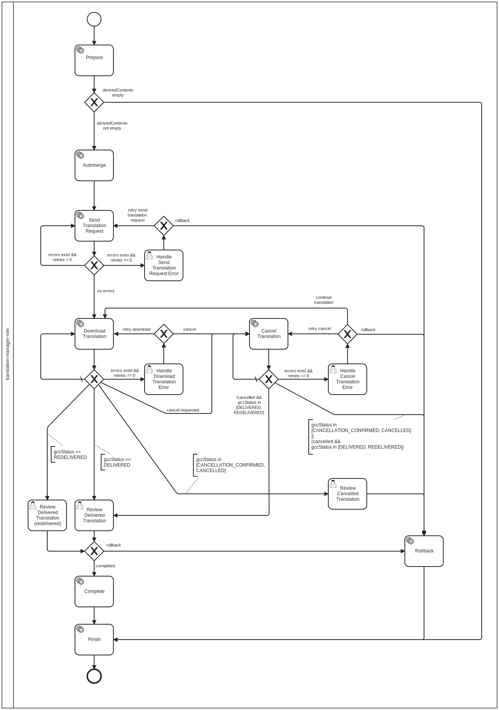

# GCC-Workflow.bpmn

The workflow diagram is provided as BPMN 2.0 Diagram (Business Process Model
and Notation) file. It can be opened with any BPMN 2.0 compliant tool. The
diagram is eventually exported as SVG file.

An editor to use available at:

* [bpmn.io](https://bpmn.io/)
