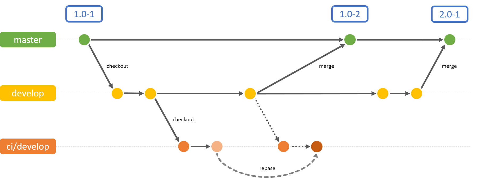

# Development

--------------------------------------------------------------------------------

\[[Up](README.md)\] \[[Top](#top)\]

--------------------------------------------------------------------------------

## Table of Content

1. [Introduction](#introduction)
2. [Adding GCC Adapter to the Blueprint](#adding-gcc-adapter-to-the-blueprint)
3. [Enabling the Extension](#enabling-the-extension)
4. [Adding GCC Workflow to Workflow Server Deployment](#adding-gcc-workflow-to-workflow-server-deployment)
5. [Enabling External Definition of API Key](#enabling-external-definition-of-api-key)
6. [Extension Point for Custom Properties](#extension-point-for-custom-properties)
7. [Design Details](#design-details)
8. [Workspace Structure](#workspace-structure)
9. [See Also](#see-also)

## Introduction

In order to start using the GCC Labs Project you have to add the project to
your Blueprint extensions. The following process assumes, that you will add
the GCC extension as GIT submodule to your workspace. You may as well decide
to copy the sources to your workspace.

To summarize the steps below, everything you need to do:

1. Add GCC to your Blueprint workspace at `modules/extensions`.
2. Configure your extension tool.
3. Run your extension tool to activate the gcc extension.
4. Add `translation-global-link.xml` to your workflow server deployment.
5. Later on: Ensure that your GlobalLink Settings reside in
    `/Settings/Options/Settings/Translation Services/GlobalLink`

### Branches



* **main:** Will be initially used to create `develop` branch. Afterwards,
  it will just be used to merge changes from `develop` branch to `main`,
  i.e., it will just be recipient afterwards. On _release_ the main merge
  commit will be tagged. See below for details on tagging.

* **develop:** After initial creation, all development by CoreMedia and
  merging pull request will happen here.

* **ci/develop:** An artificial branch required for CoreMedia CI systems. It is
  required, as for CoreMedia CI we need to change the parent POMs in that way,
  that we set the version to `9999.9` and add a relative path, so that
  it matches our workspace setup.

  As soon as changes from `develop` shall be published to CI, we rebase
  the adaptions:

  ```bash
  $ git checkout "ci/develop"
  $ git rebase "origin/develop"
  $ git push --force-with-lease

### Tags

The structure of tags is as follows:

```text
<CMCC Version>-<GlobalLink Workspace Version>
```

Thus, `1907.1-1` signals compatibility with CMCC 1907.1 and is the first
version of this GlobalLink workspace. `1907.1-2` is a patch version for
version `1907.1-1`, which is based on the same CMCC version, but for example
contains bug fixes.

## Adding GCC Adapter to the Blueprint

There are many approaches for integrating the extension into
the Blueprint. Each one comes with its own pros and cons depending on your use
case.

With `git subtree` you can easily change the adapter code and cherry-pick important
fixes of upcoming releases without having to create a fork of the adapter itself.
This is one of the main advantages of the subtree approach over `git submodule`. 
Contributing back upstream is however slightly more complicated.

Feel free to choose the strategy that fits your needs best. For example:

* As a Git Subtree from the workspace root (recommended)

    ```bash
    $ mkdir -p modules/extensions
    $ # Add sub-project as a remote to enable short form
    $ git remote add -f gcc https://github.com/CoreMedia/coremedia-globallink-connect-integration.git
    $ git subtree add --prefix modules/extensions/gcc gcc main --squash
    $ # For example - update the sub-project at a later date...
    $ git fetch gcc main
    $ git subtree pull --prefix modules/extensions/gcc gcc main --squash
    ```

    See [Issue 28](https://github.com/CoreMedia/coremedia-globallink-connect-integration/issues/28) for
    a more detailed description of a similar approach.

* Or as a Git Submodule from the workspace root

    ```bash
    $ git submodule add https://github.com/CoreMedia/coremedia-globallink-connect-integration.git modules/extensions/gcc
    $ git submodule update --init --recursive
    $ cd modules/extensions/gcc
    $ git checkout <release-tag>
    $ cd ..
    $ # Add and commit .gitmodules and current HEAD of submodule 
    $ git add .
    $ git commit -m "Initial integration of submodule based on <release-tag>"
    ```
  
If you want to contribute to this project - which we hope for - you 
need to fork the project. For example, with the `git subtree` approach, pushing 
to your fork could look as follows:

```bash
$ # Add your fork as another remote
$ git remote add -f my-gcc https://github.com/my-company/coremedia-globallink-connect-extended.git
$ # For example - update the sub-project at a later date...
$ git subtree push --prefix=modules/extensions/gcc my-gcc main
```

You can then send us the corresponding pull request.

## Enabling the Extension

Execute the following command in `workspace-configuration/extensions` below the
workspace root folder:

```bash
$ cd workspace-configuration/extensions
$ mvn extensions:sync -Denable=gcc
``` 

This will activate the extension. The extension tool will
also set the relative path for the parents of the extension modules.

## Adding GCC Workflow to Workflow Server Deployment

You need to add `translation-global-link.xml` to your workflow definitions
in `global/management-tools/management-tools-image/src/main/image/coremedia/import-default-workflows`.
Add `TranslationGlobalLink:/com/coremedia/labs/translation/gcc/workflow/translation-global-link.xml`
to the variable `DEFAULT_WORKFLOWS`.

## Enabling External Definition of API Key

If the _API key_ for communication with GlobalLink is to be set externally
upon system startup, add the following lines to file `apps/workflow-server/spring-boot/workflow-server-app/src/main/resources/application.properties`:

```
# GlobalLink
gcc.apiKey=
```

If in doubt, check with the system's administrator how the API key is to be 
defined. See [Server-side configuration](administration.md#server-side-configuration)
in _Administration Guide_.

## Extension Point for Custom Properties

In case you need additional properties for interacting with GlobalLink REST
backend, you may need to extend the Studio Workflow UI as well as the
Workflow Actions. You will find details how to do that here:

* [Blueprint Developer Manual / Configuration and Customization][DOC-CM-TRANSLATION]
* [Blueprint Developer Manual / Translation Workflow Studio UI][DOC-CM-TRANSLATION-UI]
* [Workflow Manual / Workflow Variables][DOC-WF-VARS]

## Design Details

### Translation Types

In CoreMedia CMS there exist two translation types:

1. Translation to derived sites, and
2. Translation to preferred site.

While for _Translation to derived sites_ the site-managers of the master site send
localization/translation items to the derived sites, the local site-managers of
each derived site may as well trigger translation from master site to their
derived site (assumed to be set as preferred site).

This implementation is designed to support _Translation to derived sites_ and instead
of local site-managers accepting the translation, it is designed, so that the
site-manager of the master site will also take care of accepting the translation
results.

### CMS Workflow to GCC Workflow

GCC uses specific terms for the structure of their translation workflow. The
terms are important to understand, especially how they map to the CoreMedia
CMS translation workflow:

* **Submission:**

    The CMS translation workflow creates and starts a submission when handing
    over the contents to be translated to GCC. A submission has one source
    locale and consists of several jobs.
    
* **Job:**

    One job is bound to one target locale. It may consist of several tasks.
    In this implementation jobs are not really visible. See _Task_ documentation
    below.
    
* **Task:**

    One task is bound to one file to translate. As the CoreMedia CMS translation
    workflow creates one XLIFF document per target site/target locale, all jobs
    of this implementation only contain one task. 
 
#### Workflow Stages

A rough sketch of the CoreMedia CMS translation workflow shows how the
GCC translation workflow is embedded into the CMS workflow (here: standard
processing):

1. **Preprocessing Phase:** In this phase, the target contents are prepared to
    receive the translation results later on. Missing contents are created,
    links are adjusted, some properties automatically merged (like linklists
    for example).
2. **Translation Phase:** Contents are handed over as XLIFF documents to GCC.
    The state is regularly polled. XLIFF documents from completed tasks are
    automatically downloaded and applied. Changes are applied as
    translation-workflow-robot user.
3. **Postprocessing Phase:** Once the submission is completed, the CMS workflow
    switches to post-processing phase. Editors have the change to review the
    translation and eventually accept the translation. As soon as they accept
    the translation, the last step is to update the master version number in
    the target contents, to signal from which master version they received
    the updates.

### Cancellation

GCC offers cancellation at task and submission level. Note, that the
CoreMedia CMS translation workflow does not support cancellation at task
level.

The reason can be found in the _Workflow Stages_ mentioned above.
When a cancellation is detected, target contents may have received some changes 
already, and cancellation requires to revert all those changes. As there is no partial
revert of some contents, all contents which are part of the CMS translation
workflow need to be reverted.

Thus, as the existing CMS API does not support partial cancellation, the same applies
to the GCC submission which must not be partially cancelled.

The current implementation is aware of partial cancellation, though: If only some
tasks are cancelled, the implementation will stop downloading results from these
tasks and wait for the whole submission to be marked as cancelled. Such wait
loops are logged.

_Planned/Later:_ If you perform cancellation within the CMS workflow, it is always ensured,
that the complete submission is cancelled.

### One Workflow for all Locales vs. One Workflow per Locale

Per default the GCC extension will create one workflow instance for all locales,
that were chosen in the _StartWorkflowWindow_. Each locale results into a separate
Job, which are all bundled under one submission, that is tracked by one workflow.

This means that the workflow is only marked as completed, 
when all locales (Jobs) have been marked as completed.

The GCC extension can also be configured, to start one workflow instance
per locale. This means that one submission, holding only one job is created per chosen locale.

This can be achieved by setting the value _createWorkflowPerTargetSite_ in the GccStudioPlugin
to _true_ (this is actually the default, therefore you can also completely remove this configuration).
Furthermore you need to change the type of the workflow variable _targetSiteId_ in the workflow definition _translation-global-link.xml_
to _String_.

### Not supported: Reopening

Reopening submissions is not supported by this implementation. Instead, please
start a new translation workflow for contents where you want to get the translation
result adjusted.

Implementing reopening would require to cope with challenges like the following:

* **Polling:** The implementation uses polling the translation state, while a
    CoreMedia workflow is active. Polling ends as soon as the CoreMedia workflow
    is done. In order to respond to reopening submissions at GCC you either need
    to keep polling even after the workflow is done, or you need to change the
    implementation to use push notifications from GCC backend instead. Push
    notifications is not part of this implementation as it would require to
    expose an additional service of the CoreMedia CMS backend.
* **Updated Contents/Resolving Conflicts:** As reopening may occur after several
    days or even months, it is most likely that your target contents got updated
    meanwhile. Trying to re-import new translation results may cause hard to
    resolve conflicts, because of for example missing linked documents in
    CoreMedia RichText.

## Workspace Structure

### workflow-server
Manages the workflow-server extension and the gcc-restclient-facade

#### gcc-restclient-facade*

Facades to GCC Java REST Client API. Please see corresponding
_Facade Documentation_ in the workspace for details.

#### gcc-workflow-server

The workflow definition and classes to send and receive translation via GCC REST API.

### studio-client

Extension for the Studio client that registers the workflow definition and configures the UI.

### studio-server

Extension for the Studio REST server that registers the workflow definition.

### user-changes

Extension for the User Changes web application to enable Studio notifications for the GlobalLink workflow.

### test-data

Contains a (quite empty) settings document which, after content import, needs to
be linked to your site root documents (also known as Homepages).

## See Also

* [Administration](administration.md)

--------------------------------------------------------------------------------

\[[Up](README.md)\] \[[Top](#top)\]

--------------------------------------------------------------------------------

<!-- Links, keep at bottom -->

[DOC-CM-PEXT]: <https://documentation.coremedia.com/cmcc-12/artifacts/2401/webhelp/coremedia-en/content/projectExtensions.html> "Blueprint Developer Manual / Project Extensions"
[DOC-CM-TRANSLATION]: <https://documentation.coremedia.com/cmcc-12/artifacts/2401/webhelp/coremedia-en/content/translationWorkflow_configurationAndCustomization.html> "Blueprint Developer Manual / Configuration and Customization"
[DOC-CM-TRANSLATION-UI]: <https://documentation.coremedia.com/cmcc-12/artifacts/2401/webhelp/coremedia-en/content/TranslationWorkflowUiCustomization.html> "Blueprint Developer Manual / Translation Workflow Studio UI"
[DOC-WF-VARS]: <https://documentation.coremedia.com/cmcc-12/artifacts/2401/webhelp/workflow-developer-en/content/WorkflowVariables.html> "Workflow Manual / Workflow Variables"
