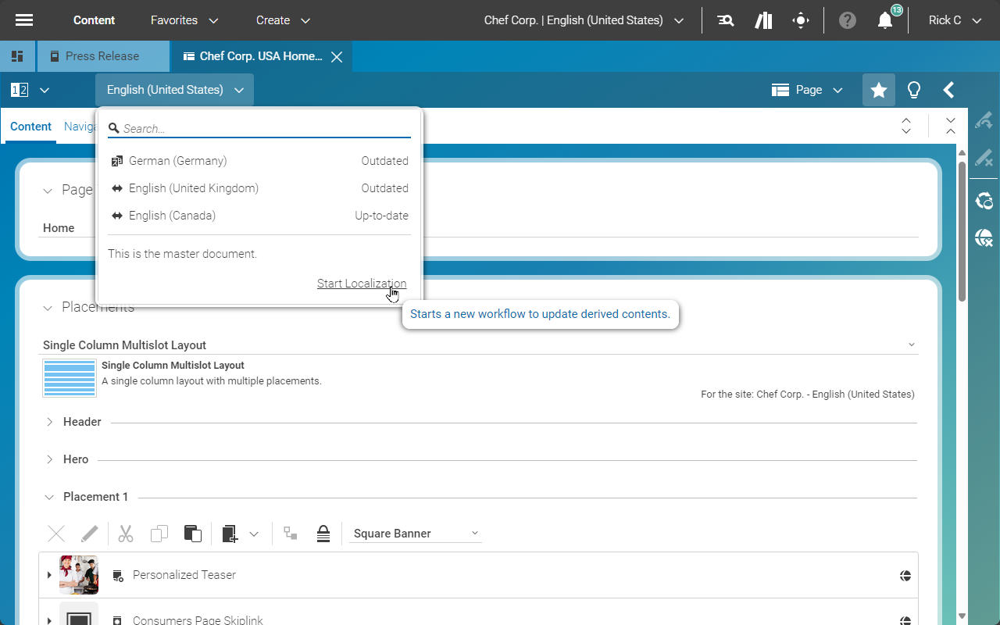
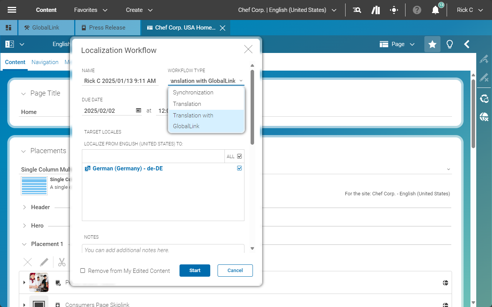
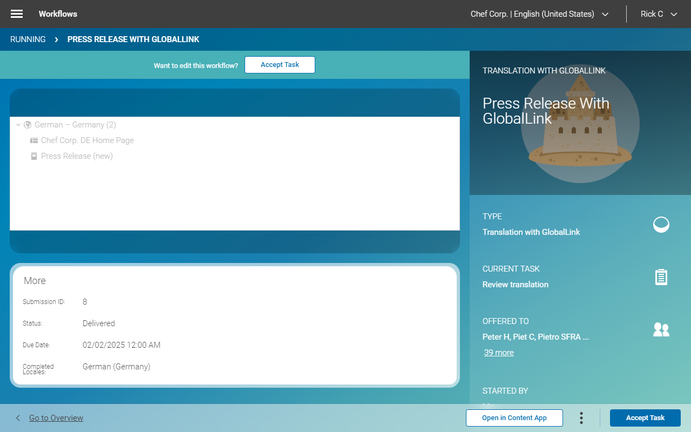

## Editorial Quick Start

--------------------------------------------------------------------------------

\[[Up](README.md)\] \[[Top](#top)\]

--------------------------------------------------------------------------------

Assuming that you are familiar with the CoreMedia Studio and that you created a
new campaign in the English master site that has now to be translated into
French, German, and Spanish. This guide shows how this task can be accomplished
by means of the GlobalLink Connect Cloud connector.

### Configure Connection to GlobalLink Connect Cloud

If the connection is not set up yet, go to `/Settings/Options/Settings/` create
a _Settings_ content called _GlobalLink_ and add it to the _Linked Settings_
property of the master site's homepage.

### Send Content to GlobalLink

Once finished working on the campaigns content, open the Control Room and click
the _Start a localization workflow_ button in the toolbar of the
_Localization workflows_.

In the _Start Localization Workflow_ window, select the workflow type
_Translation with GlobalLink_, set a self-describing name, a due date, drop the
to-be-translated content, and set the target locales.
The notes are sent as instructions for the translators.

After having started the workflow, it is shown in the pending workflow section,
and the details contain the submission id and the current state.

In case an error occurs, it is shown in your inbox, and you can select to cancel
the workflow, or you can try to fix the problem and retry.

After the translation is finished, you will receive a notification. The workflow
is shown in the inbox and once accepting the task, you can review the content
and finish it. 

Well done.

--------------------------------------------------------------------------------

\[[Up](README.md)\] \[[Top](#top)\]

--------------------------------------------------------------------------------
