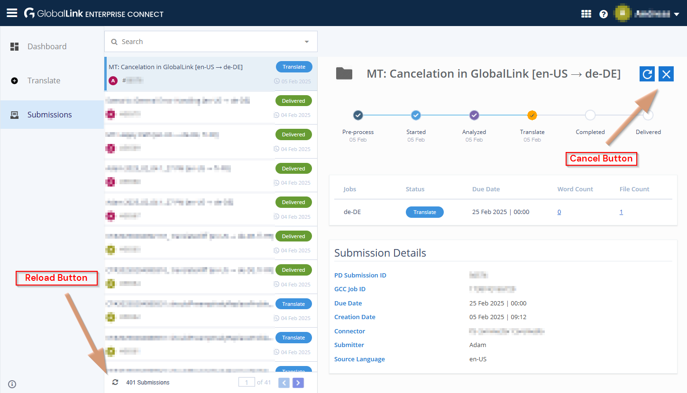

# Manual Test Steps

--------------------------------------------------------------------------------

\[[Up](README.md)\] \[[Top](#manual-test-steps)\]

--------------------------------------------------------------------------------

## Contents

### General

1. [Prepare](#prepare)
2. [General Advice for Manual Test Steps Within CoreMedia Studio](#general-advice-for-manual-test-steps-within-coremedia-studio)

### Scenarios

1. [Contract Test](#scenario-contract-test)
2. [Happy Path](#scenario-happy-path)
3. [General Error Handling](#scenario-general-error-handling)
4. [Cancelation](#scenario-cancelation)
5. [Wrong Or Invalid Connector Key Recovery](#scenario-wrong-or-invalid-connector-key-recovery)
6. [GCC Backend Error Handling (Submission Error State)](#scenario-gcc-backend-error-handling-submission-error-state)
7. [XLIFF Import Error Handling](#scenario-xliff-import-error-handling)
8. [Redelivered State Handling](#scenario-redelivered-state-handling)

## Prepare

Adjust GlobalLink-Settings within settings document at
`/Settings/Options/Settings/Translation Services/GlobalLink` for quicker
feedback during manual test-steps as well as to access the relevant sandbox
via corresponding credentials:

```yaml
globalLink:
  # [... other settings]
  # key (type: String)
  # Adjust either for automatic or manual GCC processing. To ease
  # switching keys, hold them in the prepared extra Struct
  # at `additionalConfigurationOptions.exampleKeys` for an easy copy & paste:
  key: "..."
  # apiKey (type: String)
  # Only used for testing. Otherwise, expected to be set via Spring for
  # security reasons.
  apiKey: "..."
  # type (type: String)
  # Adjust to "default" for processing at GCC backend or "mock" for manual
  # processing. See also: `additionalConfigurationOptions.availableTypes`.
  type: "default"
  # isSendSubmitter (type: Boolean)
  # Adjust to `true` to send the submitter with the request.
  isSendSubmitter: false
  # Section: Timing Adjustments — Get Faster Feedback on Manual Test Steps
  # Despite `retryCommunicationErrors`, which just needs to be adjusted,
  # find copy & paste ready values for the other settings in the
  # `additionalConfigurationOptions` Struct.
  sendTranslationRequestRetryDelay: 60
  downloadTranslationRetryDelay: 60
  cancelTranslationRetryDelay: 60
  retryCommunicationErrors: 1
  # Section: Submission Instruction Type Settings
  submissionInstruction:
    # [...]
    # characterType (type: String)
    # Adjust to "unicode" to provoke errors in the GCC backend, as it does
    # not support SMP characters.
    characterType: "unicode"
  submissionName:
    # [...]
    # characterType (type: String)
    # Adjust to "unicode" to provoke errors in the GCC backend, as it does
    # not support SMP characters.
    characterType: "unicode"
  # Section: Mock Settings
  # Referenced below, like to provoke errors are certain states.
  mock:
    # [...]
```

## General Advice for Manual Test Steps Within CoreMedia Studio

* **Settings as Favorite**:

  It is recommended to add the settings document
  `/Settings/Options/Settings/Translation Services/GlobalLink` to the
  "Favorites" in Studio. It is required to be adapted multiple times during
  the manual test steps.

* **Start Workflow Options**:

  There are various ways to start localization workflows. Choose one of them
  during your test-steps and possibly switch to others for further steps. Some
  available options are:

    * Drag an article into the "Localization Workflows" drop area in Control
      Room.
    * Choose "Start Translation Workflow" within the Locale Switcher of an
      opened document.

* **Workflow Interaction Options**:

  Just as for when starting the workflow, you have multiple ways to interact
  with the workflow. Choose one of them during your test-steps and possibly
  switch to others for further steps. Some available options are:
    
    * **In Localization Nagbar**: To directly switch from a document to its
      assigned localization workflow, click on one of the available options in
      the nagbar, which is either clicking the link, to jump to the
      _Workflow App_ or click on the button, to open the workflow within a
      sidebar.

    * **Control Room**: Provides an overview of running workflows and allows
      you to interact with them.

    * **Workflow App**: Provides a more detailed view of the workflow.

    * **Workflow Sidebar**: Opened within the Content App, providing an
      overview of the workflow.

* **Studio Localization**:

  It is good practice, to switch the language of the Studio UI from time to
  time, to ensure also German labels are available.

## Test Matrix Template

The following table can be copied, to track your test results. Copy it to a
suitable application (like your approval task issue, for example) and fill
it with your results.

### All Scenarios

| Scenario                     | Connector Type | Key Type     | Status | Notes |
|------------------------------|----------------|--------------|--------|-------|
| Contract Test                | `default`      | `automatic`  |        |       |
| Happy Path                   | `default`      | `automatic`  |        |       |
| General Error Handling       | `default`      | `automatic`  |        |       |
| Cancelation (Studio)         | `default`      | `manual`     |        |       |
| Cancelation (GlobalLink)     | `default`      | `manual`     |        |       |
| Cancelation (Error Handling) | `default`      | `manual`     |        |       |
| Wrong/Invalid Connector Key  | `default`      | `manual`     |        |       |
| GCC Backend Error Handling   | `mock`         | _irrelevant_ |        |       |
| XLIFF Import Error Handling  | `mock`         | _irrelevant_ |        |       |
| Redelivered State Handling   | `mock`         | _irrelevant_ |        |       |

### Contract Test Results

| Test Case                                    | Status | Notes |
|----------------------------------------------|--------|-------|
| `shouldRespectInstructions` (`BMP`)          |        |       |
| `shouldRespectInstructions` (`FORMAT`)       |        |       |
| `shouldRespectInstructions` (`HTML_AS_TEXT`) |        |       |
| `shouldRespectInstructions` (`UNICODE_SMP`)  |        |       |
| `shouldRespectSubmitter` (`YES`)             |        |       |
| `shouldRespectSubmitter` (`NO`)              |        |       |
| `shouldRespectSubmitter` (`DEFAULT`)         |        |       |


## Scenario: Contract Test

Especially on updates of `gcc-restclient` you should run the half-automatic
test `DefaultGCExchangeFacadeContractTest`. Read the JavaDoc to know how to
configure and run the test.

Lately, when using the automatic workflow, the submission is not marked as
`DELIVERED` anymore. This is why the `translateXliff` test fails. It seems to
work with the manual workflow though.

### Set Up

To run the test you need to create a file with the name
[.gcc.properties](example.gcc.properties.txt)
in your user home folder

### Manual Review

Please review the following aspects **in the management dashboard** of
GlobalLink manually (all submissions created by this test should have a name
starting with `CT` and a timestamp).

#### Instructions

The test `shouldRespectInstructions` should have created submissions with
so-called "submission instructions" (in the workflow: "Notes") for these
scenarios (by ID):

* `BMP` (refers to Base Multilingual Plane)

  It is expected that each described character is represented visually as
  described within the test fixture. Thus, arrows should be visible as arrows
  and even high level Unicode character from BMP should be displayed correctly
  (e.g., the "Fullwidth Exclamation Mark": `！`).

* `FORMAT` (refers to newlines and tabs)

  As instructions in the GCC backend are expected to be HTML, the newlines
  should be replaced by `<br>` and tabs by `&nbsp;&nbsp;`. In other words:
  You should see visible line-breaks and indents.
  
* `HTML_AS_TEXT`

  Given the assumption, that in the Workflow App the instructions are given in
  plain-text, the HTML should be escaped. Thus, you should see no bold text,
  no newline triggered by a textual `<br>`, and also entities like `&amp;`
  should be visible as plain-text.

* `UNICODE_SMP` (`SMP` refers to the Supplementary Multilingual Plane)

  For now, the GCC backend is expected to not support SMP characters. Thus,
  corresponding characters like emojis (dove, for example: 🕊) should be
  replaced by a placeholder pattern. Current implementation is, to make them
  distinguishable, that the placeholder is the Unicode code point in hex, such
  as `U+1F54A`.

#### Submitter

The test `shouldRespectSubmitter` should have created submissions with
overridden submitter names (thus, must be different to the account username).
Three submissions should be visible:

* `YES`: The submitter name should be the test's name.
* `NO`: The submitter name should be the account username.
* `DEFAULT`: The submitter name should be the account username.

## Scenario: Happy Path

* **Connector Type**: `default`
* **Key Type**: `automatic`

### Quick Steps

1. Log in as **Rick C**.
2. Use `globalLink.type=default` and the **"automatic"** connector key.
3. Link two articles A → B.
4. Start a translation workflow for the article A.
5. Validate the start workflow window to show no issues and to have a due date
   set 20 days from now.
6. Start the workflow.
7. In the Workflow App, see how information are continuously updated, like
   the state, the submission ID, and the completed locales.
8. Wait until the user-task "Review delivered translation" is offered to you.
9. Validate that the target articles have received an updated
   (pseudo-)translation.

### Detailed Steps

1. **User Rick**: Log in as Rick C.

2. **Adjust Settings**: Settings to adjust/verify in
   `/Settings/Options/Settings/Translation Services/GlobalLink`:

   ```yaml
   globalLink:
     key: "<automatic workflow connector key>"
     apiKey: "..."
     type: "default"
     dayOffsetForDueDate: 20
     isSendSubmitter: true
     # Adjusted retry settings, see above for details.
     # [...]
   ```

3. **Article A**: Create an article A and remove validation issues.

4. **Article B**:Create an article B and remove validation issues.

5. **A → B**: Create a link from the article A to the article B.

6. **Start Workflow Window**: Trigger starting the workflow and validate the
   default values:

    1. **No Issues**: There should be no warnings or errors
    2. **Due Date**: Field _Due Date_ should be set to the current date/time plus 20 days
    3. **Dependent Content**: Article B should be added as dependent content.
    4. **Notes**: Add some text to the field _Notes_.

7. **Start Workflow**: Click “Start”

    1. The dialog should close without any error
    2. A nagbar should appear in the document form, stating that the documents
       are being translated.

8. **Workflow App**: Navigate to the workflow details within the _Workflow App_.

9. **Workflow Details (In Progress)**: In the workflow's detail view, validate:

    1. After some time, _Status_, _Submission ID_, and _Due Date_ should be
       shown.
    2. As long as the workflow is in "Running", field “Completed Locales”
       should display “0 Locales”.

10. **Workflow Details (Done, Review)**: Later in the workflow's detail view,
    validate:

    1. The “Status” field should display “Delivered”
    2. The “Completed Locales” field should display the target locales of
       the workflow
    3. When clicking on the translated content, it should open in language
       comparison view in CoreMedia Studio.
    4. The text is expected to be pseudo-translated (behavior provided by the
       GCC backend).

11. **Finish Workflow**: In the _Workflow App_, click “Accept Task”,
    "Next Step", “Finish Content Localization”, and "Yes, continue"

    1. The workflow should disappear from “Open”
    2. The workflow should appear in “Closed”

In addition to the above steps and in addition to the results from the
contract test, you may want to review in GCC Management Dashboard:

* That `Rick C` is set as the submitter for the submission.
* That the notes are visible in the submission (as instructions).

## Scenario: General Error Handling

* **Connector Type**: `default`
* **Key Type**: `automatic`

1. Log in as Rick C.

2. Open the GlobalLink
   settings `/Settings/Options/Settings/Translation Services/GlobalLink`
   1. `type` is set to `default`
   2. Credentials for gcc are entered (**manual** workflow key)

3. **Break it:** Change the `apiKey` to something wrong, for example, add a `-`
   (minus) to the beginning.

4. Start a translation workflow for an article.

5. Wait for the workflow to appear in _Workflow App_'s "Open" workflows
   
   1. The icon should be a warning sign
   2. The "Current Task" in _Workflow App_'s detail view should be “Upload
      Error”

6. Click "Accept Task" and "Next Step"
 
   1. You have the ability to “Abort and rollback changes” or
      “Continue and retry”
   2. A click on “Abort and rollback changes” should perform a rollback of the
      content (if you perform that you need to redo steps above)

7. Set `apiKey` in GlobalLink settings to its valid value and click “Continue
   and retry”

8. Open the workflow's details in the Workflow App and wait for this state
   before you continue:

   1. The status should change to “Translate”.
   2. The "Submission ID" should be set.

9. Set `apiKey` in GlobalLink settings to something wrong again.

10. Wait for the task to change to "Download Error".

11. Accept the task.

    1. Validate available options when pressing "Next" are:
       1. Abort and rollback changes
       2. Continue and retry

12. Select “Abort and rollback changes” (which will subsequently try to
    trigger a cancelation at GlobalLink).

13. Wait for the current task to change to "Cancelation Error".

    1. The icon should signal a warning.

14. Accept the task.

    1. Validate available options when pressing "Next" are:

        1. Abort and rollback without canceling at GlobalLink
        2. Retry cancelation
        3. Continue translation

15. Set `apiKey` in GlobalLink settings to its valid value.

16. Choose "Continue translation"

17. The workflow should end without errors and appear in Closed.

## Scenario: Cancelation

* **Connector Type**: `default`
* **Key Type**: `manual`

### Cancelation in Studio

1. Log in as Rick C.

2. Open the GlobalLink
   settings `/Settings/Options/Settings/Translation Services/GlobalLink`

    1. `type` is set to `default`
    2. Credentials for gcc are entered (**manual** workflow key)

3. Start a translation for an article.

4. Select the started translation in the control-room.

5. Click the “X” in the header bar and confirm the dialog.

6. Open the "Closed" area in the Workflow App.

7. Wait for the translation process to appear in "Closed".

8. Check:

   1. The “Status” field should display “Canceled”
   2. The icon should mark the workflow as canceled (little “x” on the bottom right)

### Cancelation in GlobalLink

1. Log in as Rick C.

2. Open the GlobalLink
   settings `/Settings/Options/Settings/Translation Services/GlobalLink`

   1. `type` is set to `default`
   2. Credentials for gcc are entered (**manual** workflow key)

3. Start a translation for an article.

   It is recommended to set a distinguishable name for the workflow, to better
   locate in the next step.

4. Log in to the _GlobalLink Management Dashboard_ and cancel the workflow.

   The "Cancel" button used to be in the upper right corner of the opened
   submission.

   

5. Go back to the _Workflow App_
 
   1. After a while, the workflow should appear in Rick's "Open" workflows
   2. When accepting the task, Rick can only choose to abort and rollback the
      previous changes and accept the cancelation.
   3. Choose "Abort and rollback changes".

6. Open the "Closed" area and open the canceled workflow.
 
   1. Field “Status” should display “Canceled”
   2. The icon should mark the workflow as canceled (little “x” on the
      bottom right)

### Cancelation Error Handling

The following test is about the error handling of a cancelation, as well as it
includes testing UI behaviors for multi-selection.

1. Log in as **Rick C**.

   Required to use Rick C here, as Adam, for example, will not be able to do the
   multi-selection test, as local translations will appear in "Open" section for
   Adam.

2. Open the GlobalLink
   settings `/Settings/Options/Settings/Translation Services/GlobalLink`

   1. `type` is set to `default`
   2. Credentials for gcc are entered (**manual** workflow key)

3. Start three translation workflows for the same article:

   1. Start a GlobalLink Translation Workflow two times.
   2. Start a default Blueprint translation workflow.

4. **Control Room**: Check the multi-selection behavior of the "X" in the
   header bar:

   1. If all selected translations are of type "GlobalLink", the "X" should be
      visible and activated.
   2. If one of the selected translations is not of type "GlobalLink", the "X"
      should be hidden.

5. **Workflow App**: Check the "X Cancel" option in the "Running" section of the
   Workflow App:

   1. If all selected translations are of type "GlobalLink", the "X" should be
      visible and activated.
   2. If one of the selected translations is not of type "GlobalLink", the "X"
      should be hidden.

6. **Break it**:

   Consider to temporarily change the `globalLink.retryCommunicationErrors` to
   `2` to give you more time (120 seconds) to proceed with the next steps.

   Prepare to change, for example `globalLink.apiKey` to some invalid value like
   adding a `-` (minus) as first character. This will cause subsequent calls to
   GlobalLink to fail.

   Before that, either have your control-room open, or the workflow app in an
   extra window. For a single-screen setup, it is recommended to use the
   control-room.

   **Do it**: Now, break the connection to GlobalLink by changing the `apiKey`.

7. **Speed Mode, Step 1**: Select both "Translation with GlobalLink" workflows
   and click the “X”. Acknowledge the dialog to proceed the cancelation.

8. **Speed Mode, Step 2**: Check that already now, the "X" button/menu-entry
   is disabled.

   **You may calm down now, as the following steps are not time-critical.**

9. **Workflow App**: Open one of the workflows.

10. Wait for the workflow to reach the task named "Cancelation error".

11. Validate the following:

    1. The "Current Task" field should display "Cancelation Error".
    2. The "Status" field should display "Canceled".
    3. The icon should signal a warning.

12. Click "Accept Task" and "Next Step"

    1. Validate options, that should be available:

       1. Abort and rollback without canceling at GlobalLink
       2. Retry cancelation
       3. Continue translation

    2. Click "Abort and rollback without canceling at GlobalLink" and open the
       target site's document
 
       1. The document should remain in its previous version.

    3. Go back to the _Workflow App_ overview
 
       1. The workflow should be moved from the "Running" to the "Closed" list
       2. The “Status” field in _Workflow App_'s overview should display
          “Workflow completed”
       3. The icon should mark the workflow as canceled (little “x” on the
          bottom right)

## Scenario: Wrong Or Invalid Connector Key Recovery

This test is about a robustness layer introduced with 2406.1 approval: If during
a running translation workflow you change the connector key (stored as
`globalLink.key`) to another (but valid connector key), the workflow should
be able to recover from that scenario ones the key is valid again. Also, if the
key is invalid, the workflow should be able to recover from that scenario.

* **Connector Type**: `default`
* **Key Type**: `manual` (initially)

### Quick Steps

1. Log in as Rick C.
2. Use `default` type, and the "manual" connector key.
3. Start a translation of an article and wait for the submission ID to be
   retrieved.
4. Change the connector key to "automatic".
5. See that error-handling-task is reached with an issue about an unknown
   submission.
6. Change the connector key to an invalid key.
7. Trigger retry.
8. See that error-handling-task is reached with an issue about an invalid
   connector key.
9. Set the connector key back to "manual".
10. Trigger retry.
11. The workflow should continue polling the translation state without issues.

### Detailed Steps

1. Log in as Rick C.

2. Open the GlobalLink
   settings `/Settings/Options/Settings/Translation Services/GlobalLink`

   1. `type` is set to `default`
   2. Credentials for gcc are entered (**manual** workflow key)

3. Start a translation for a given article.

4. **To Workflow App:** Navigate, for example via the nagbar, to the
   _Workflow App_ and wait until the workflow is in the "Translate" state
   (Current task: "Awaiting translation results").

5. **Content App:** Change the connector key to another valid key (thus,
   "automatic").

6. **Workflow App:** Wait until the current task changes to "Download Error".

7. Accept the task.

8. **Content App:** Change the connector key to an invalid key, for example,
   prefix it with an additional `0`.

9. **Workflow App:** Click "Next Step". Validate an error is shown about an
   unknown submission, triggered by our previous misconfiguration.

10. Choose "Continue and retry".

11. Wait until the current task changes to "Download Error" again.

12. Accept the task.

13. **Content App:** Change the connector key back to our initial, valid key
    (thus, "manual").

14. **Workflow App:** Click "Next Step". Validate an error is shown about an
   invalid connector key, triggered by our previous misconfiguration.

15. Choose "Continue and retry".

16. The workflow should continue polling the translation state without issues.

## Scenario: GCC Backend Error Handling (Submission Error State)

This test is about submissions within the GCC backend, which are in an error
state. This has been observed, for example, when trying to send a submission
with instructions containing characters from the Supplementary Multilingual
Plane (SMP).

**Alternative Scenario:**
The given manual test steps "mock" this state, as we cannot ensure that an
error persists over time. If you want to test the real-life behavior, you
may choose using the "default" rather than the "mock" type and instead of
using `mock.error`, you may use the `submissionInstruction.characterType`
setting. Set it to `unicode` and add some SMP characters to the instructions
(thus, workflow notes), like for example, the dove emoji: 🕊.

**Advantage**: The advantage of the real-world scenario is, that you may also
test, that a submission in an error state may still be canceled.

* **Connector Type**: `mock`
* **Key Type**: _irrelevant_

### Quick Steps

1. Log in as Rick C.
2. Use `mock` type.
3. Set `mock.error` to `SUBMISSION_ERROR`. For a quick path, you may skip
   the extra submission state mocking as sketched in the detailed steps.
4. Start a translation of an article.
5. Open the started workflow process.
6. Expect a user-task "Download error" and accept it.
7. Validate that a localized error message like "General submission failure"
   is shown.

### Detailed Steps

1. Log in as Rick C.

2. Open the GlobalLink
   settings `/Settings/Options/Settings/Translation Services/GlobalLink`

   1. `type` is set to `mock`
   2. `mock.error` is set to `SUBMISSION_ERROR`
   3. **Submission State Mocking**: Add (or activate) the following mock
      settings (optional step, but recommended to test closer to the real-world
      scenario):
      ```yaml
      mock:
        # [...]
        submissionStates:
          Started:
            override: Pre-Process
            # Mark as final to ease mocking here. Prevents further states,
            # though, which is, that you also cannot cancel the submission
            # in this mocked scenario.
            final: true
      ```

3. Start a translation for an article.

4. Open the workflow in _Workflow App_ via nagbar shown in the article.

5. Wait until the current task is "Download error" and offered to you.

6. Accept the task.

7. Click the error issue information and see a "General submission failure."

In the real-world scenario, you may now continue like to "Abort and rollback
changes" as most likely, the submission cannot be repaired. This is not possible
in this simple mocked scenario, though.

## Scenario: XLIFF Import Error Handling

* **Connector Type**: `mock`
* **Key Type**: _irrelevant_

1. Log in as Rick C.

2. Open the GlobalLink
   settings `/Settings/Options/Settings/Translation Services/GlobalLink`

    1. `type` is set to `mock`
    2. `mock.error` is set to `DOWNLOAD_XLIFF`

3. Start a translation for an article.

4. Wait for the workflow to appear in _Workflow App_'s "Open" workflows

    1. The icon should be a warning sign

5. Open the workflow details:

    1. Field "Current Task" should be “Download error”
    2. In the section "More", a download link for the broken XLIFF should be
       shown under "Issue Details"

6. Click the XLIFF download link

    1. Both the XLIFF and an issue details text file should be included

7. Click "Accept Task" and "Next Step"

    1. You should have the ability to “Abort and rollback changes” or
       “Continue and retry”

## Scenario: Redelivered State Handling

* **Connector Type**: `mock`
* **Key Type**: _irrelevant_

It has been observed, that, if the XLIFF is broken, it is not necessarily fixed
within the GCC backend. Instead, the workflow is marked as "Redelivered", and
the XLIFF is provided by different means, such as sent via email.

The following steps simulate this scenario:

1. Log in as Rick C.

2. Open the GlobalLink
   settings `/Settings/Options/Settings/Translation Services/GlobalLink`

   1. `type` is set to `mock`
   2. Set `retryCommunicationErrors` to `0` (assumed to ease state mocking)
   3. `mock.error` is set to `DOWNLOAD_XLIFF`
   4. **Submission State Mocking**: Add (or activate) the following mock
      settings:

      ```yaml
      mock:
        # [...]
        submissionStates:
          Completed:
            # Directly after "Completed" state, the submission is marked as
            # "Redelivered".
            after:
              # We need to duplicate the state, as otherwise you may observe
              # the "Review Redelivered Translation" task, to be triggered
              # directly after "Completed" and not, after we got into the
              # error handling task.
              - Completed
              - Redelivered
            # Mark the state as final, not to continue with the next
            # (standard) state.
            final: true
      ```

      **Side Note** For now, we accept the duplicate state. We may want to
      review, though, if processing (or mocking) can be optimized here.

3. Start a translation for an article.

4. Wait for the workflow to appear in _Workflow App_'s "Open" workflows

5. Double-click the workflow

   1. Field "Current Task" should be “Review Translation (redelivered)”
   2. Status should be “Redelivered”
   3. In the section "More", a download link for the broken XLIFF should be
      shown under "Issue Details" (if you skipped setting `mock.error` the
      field is not available).

6. Click the XLIFF download link

   1. Both the XLIFF and an issue details text file should be included

7. In the _Workflow App_, click “Accept Task”, "Next Step", “Finish Content
   Localization”, and "Yes, continue"

   1. The workflow should disappear from “Open”
   2. The workflow should appear in “Closed”

## Consider Cleanup

If you have time and want to do it: In Project Director you may multi-select
submissions, cancel them and subsequently archive them. This way, the overview
at least in Project Director is kept clean.

--------------------------------------------------------------------------------

\[[Up](README.md)\] \[[Top](#manual-test-steps)\]

--------------------------------------------------------------------------------
