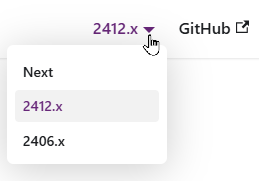

# Website

This website is built using [Docusaurus](https://docusaurus.io/), a modern
static website generator.

## Cheat Sheet

| Command                   | Description                                |
|---------------------------|--------------------------------------------|
| `pnpm build`              | Build website artifacts (to `build/`).     |
| `pnpm clear`              | Clear Docusaurus cache.                    |
| `pnpm deploy`             | Deploy to `gh-pages` branch.               |
| `pnpm docusaurus <cmd>`   | Execute Docusaurus command.                |
| `pnpm install`            | _(required)_ Install dependency artifacts. |
| `pnpm serve`              | Serve website artifacts (from `build/`).   |
| `pnpm start`              | Start local server (opens default browser) |
| `pnpm validate:overrides` | Check overrides                            |

> 💡 **Dependency Overrides:** This project uses `pnpm.overrides` to fix
> security vulnerabilities. Before updating major dependencies (especially
> `@docusaurus/core`), run `pnpm validate:overrides` to check if overrides are
> still needed.
>
> See [DEPENDENCY_OVERRIDES.md](./DEPENDENCY_OVERRIDES.md) for full details.

## Installation

```bash
pnpm install
```

## Local Development

```bash
pnpm start
```

This command starts a local development server and opens up a browser window.
Most changes are reflected live without having to restart the server.

To start without opening the default browser, use:

```bash
pnpm start --no-open
```

If you observe some caching issues, you may want to call this before start:

```bash
pnpm clear
```

The site will be reachable here:

* <http://localhost:3000/coremedia-globallink-connect-integration/>

For debugging, you may want to open:

* <http://localhost:3000/coremedia-globallink-connect-integration/__docusaurus/debug>

## Create new Version

To create a new versioned documentation branch (thus, a new versioned folder
within the website), run, for example:

```bash
pnpm version-snapshot 2412.x
```

See details in "Contributors" section of the website.

## Covered by GitHub Action

The following steps are covered by a GitHub action. You may still want to
trigger them manually for testing purpose, for example.

### Build

```bash
pnpm build
```

This command generates static content into the `build` directory and can be
served using any static contents hosting service.

### Deployment

```bash
GIT_USER=<Your GitHub username> pnpm deploy
```

This will push the website to the `gh-pages` branch.

## Structure

The documentation is separated into two aspects: a _versioned_ `docs/` folder
and a _not versioned_ `dev/` folder. The primary site is shipped from the
`docs/` folder, while you will find the unversioned part at _"Contributors"_
from the header navigation.

## No Versioned Documentation

Docusaurus provides support for versioned documentation, thus, with a command
like the following, we could create a snapshot of the documentation, so that
visitors can navigate between different CMCC versions:

```bash
pnpm docusaurus docs:version 2406.x
```

Visitors would get a version selector then:



> ℹ️ **More Information**
>
> For more information on versioned documentation (why it should be used with care,
> how to maintain versions, how to add a version navigation element, etc.) see
> [Docusaurus > Guides > Docs > Versioning](https://docusaurus.io/docs/versioning).

In August 2025 we decided not to use this approach for these reasons:

* **Relevant Maintenance Costs:**
  Unlike typical VCS there is no support to apply changes to different versions.
  Thus, for any change that must make it to all version branches, you have to
  manually apply them. Given, for example, a new location for the CMCC official
  documentation, you need to change it in all versioned branches.

* **Workaround Exists:**
  Just as before introducing a site based on Docusaurus, older versions of this
  documentation can be navigated directly within the repository (with acceptable
  limitations, due to missing Docusaurus features).

  Even then, the given version could be switched to and the site being
  browsed by `pnpm start` for example, taking benefit of all rendering
  features.

* **Limited Gain:**
  Due to Docusaurus' recommendation for versioned documentation, we would not
  provide fine-grained documentation for each and every approved version, but
  instead only for _major_ versions (thus, changes in the first number of the
  CMCC version). That is why a previous proof-of-concept introduced versions
  `2406.x`, `2412.x` etc. only.

If you consider to re-introduce versioned documentation, note, that the current
folder layout is prepared in that way, that documentation that must not be
versioned is placed in `dev/` while documentation related to approved CMCC
versions is placed in `docs/`.

## IDE Recommendation

For editing within Visual Studio Code, you may want to install MDX support:

* [MDX - Visual Studio Marketplace](https://marketplace.visualstudio.com/items?itemName=unifiedjs.vscode-mdx)
