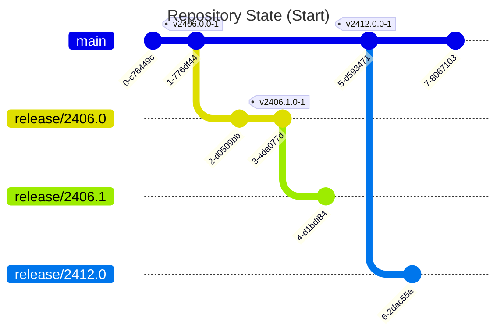
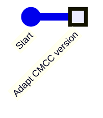
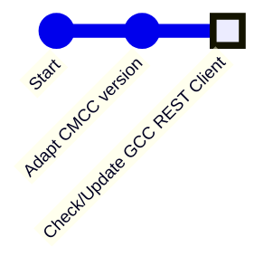
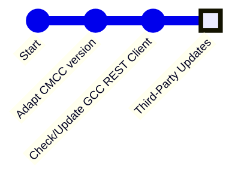
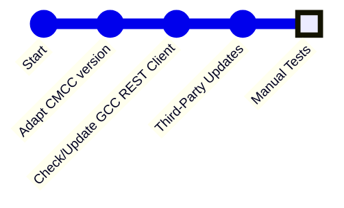
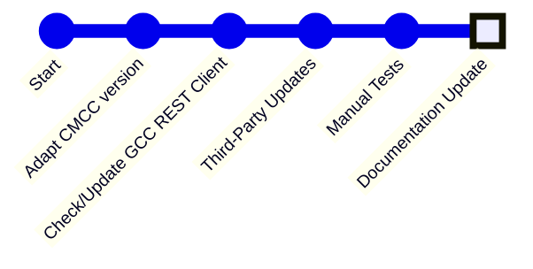
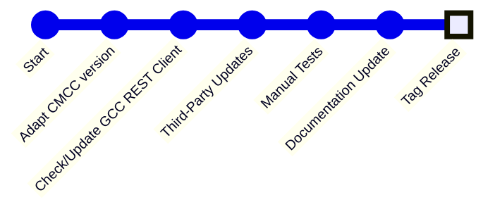

# Release Steps

:::info

Starting in August 2025, we dropped the _Git Flow_  based process in favor
of having parallel maintenance version branches.

:::

This section will guide you through a typical development, approval and
release process. We assume an approval for a new CMCC major version such as
`2506.0.0`, while before `2406.0.0`, `2406.1.0` and `2412.0.0` have been
approved already.



:::warning
Approvals done on a given branch like `origin/main` must be performed in
the same order as releases in the CMS. Thus, if you happen to have a delay
in your approval process, and `2412.0.0` as well as `2506.0.0` need to be
approved, you must strictly stick to first approving `2412.0.0`.
:::

## 1. Start Approval


For each new approval of a CMCC version, we need to apply updates to the GCC
repository (new API, new or updated dependencies and alike).

You will start with creating a branch for these adaptations. The name is not
limited but you may want to stick to the suggestion below.

```bash
git clone \
  https://github.com/CoreMedia/coremedia-globallink-connect-integration.git gcc
cd gcc
git switch --create --track "approval/2506.0" "origin/main"
# ... perform required updates ...
git commit --all --message="Update GCC REST Client to x.y.z"
git push
```

## 2. Verify Release Versions of Core Packages



If the release of this adapter targets a newer CMCC release, make sure that the
version reference `<cm.middle.core.version>` in `gcc-workflow-server-parent`
(POM path: `apps/workflow-server/pom.xml`) is updated.

:::info
Since release v2412.0.0-1` (February 2025) it is not required anymore to apply
a similar change to the Studio client code. This is because we use the
`workspace:` version inside there to refer to corresponding artifacts of the
CMCC workspace.
:::

## 3. Verify GCC REST Client Version



For each approval/release it is mandatory to check, if an updated
[GCC REST Client](https://github.com/translations-com/globallink-connect-cloud-api-java)
exists. As the GitHub repository is just a _mirrored_ repository, it may not
show the latest release version. Instead, check the version hosted at
Maven Central instead.

:::tip
For convenience, you may easily see, if an update is required on this
repository's
[home page](<https://github.com/CoreMedia/coremedia-globallink-connect-integration> "CoreMedia/coremedia-globallink-connect-integration: Translation integration via GlobalLink Connect Cloud"):

**Example:**


:::

## 4. Verify Third-Party Dependency Versions



It is considered best practice, to align third-party dependencies with the
corresponding versions of the CMS. For Maven, as we integrate as an extension,
we typically inherit dependency versions from dependency management in parent
POMs or via BOM imports.

For `apps/studio-client` we should (or must) align dependency versions. This
especially applies to the Jangaroo tooling (artifacts such as
`@jangaroo/build`, `@jangaroo/core` and alike), that should use the same version
as within the CMCC workspace.

## 4. Manual Testing



Follow the test steps as described in [Manual Test Steps](manual-test-steps.md),
starting with running `DefaultGCExchangeFacadeContractTest`, as it provides
data, that are meant to be reviewed during the manual tests.

## 5. Documentation Update



:::info
The documentation is deployed to an extra branch `gh-pages`. It is generated
by [Docusaurus](https://docusaurus.io/) and located within the `website/`
folder of this repository.

Deployment is done automatically from `main` branch, as soon as changes have
been merged.
:::

The documentation below `website/` comes in two parts. While `website/dev/`
contains unversioned documentation related to this repository (like this
section here), `website/docs/` contains the so-called _versioned documentation_.
This section is about updating the latter.

:::info
In general documentation in the versioned part is not updated. Exceptions
may apply and some known exceptions are listed below.
:::

### a) CoreMedia Documentation Links

Search for occurrences of `documentation.coremedia.com` and ensure that the
version referenced is aligned with the version to approve.

:::info
**Update Versioned Documentation:** Unlike the general rule, these links should
also be adapted in the versioned documentation folder. Thus, for an approval
of `2406.1.0` we will update the links within the `2406.x` documentation
version branch from `2406.0.0` to `2406.1.0`.

Thus, within the versioned documentation branches we always reference the latest
version of the given major release.
:::

### b) Content Revision

On each CMCC version update, we need to check if the documentation for
administrators, editors and developers are still aligned with the product.

Unless we introduced new behaviors to the GCC integration, or the integration
into CoreMedia Blueprint has to be adapted, there is nothing to be done here
most of the time.

### c) Screenshot Revision

The section _"Editors"_ contains screenshots, that may require an update.
Consider reading the corresponding [How-to](../howto/screenshots.md) to guide
you through the process (like resolutions to choose, etc.).

:::note
**Skip Update Versioned Documentation:** Unless it is about documenting new
features or behaviors, aligning screenshots, for example, to a new visual
identity of CoreMedia, should just be considered for approval of new major
versions.
:::

### d) Third-Party Reports

Used third-party libraries must be reported and their licenses integrated into
the documentation (as at least some licenses require this). We only maintain
these reports for our Maven/Java based modules.

To create a new report:

* Ensure to have built the CMCC branch before (as most dependencies will be
  taken from corresponding parents or BOMs).

* Run:

  ```bash
  mvn -Pdocs-third-party generate-resources
  ```

  This will update the auto-generated file
  `website/docs/third-party/third-party.md` as well as adding downloaded
  licenses to `website/docs/third-party/files`.

  :::info
  For generating the Markdown report `third-party.md` the FreeMarker template
  `src/main/templates/third-party-md.ftl` is used.
  :::

:::note
**Skip Update Versioned Documentation:** Due to the extra effort, we skip
maintaining third-party updates in the versioned documentation. If you want
or need to apply it, you need to move and adjust the files manually from the
main documentation (and revert changes there).
:::

### e) Add Changelog Entry

The release notes at
[GitHub/Releases](https://github.com/CoreMedia/coremedia-globallink-connect-integration/releases)
and in
[CHANGELOG.md](https://github.com/CoreMedia/coremedia-globallink-connect-integration/blob/main/CHANGELOG.md)
typically represent just an excerpt of all changes applied.

A more verbose changelog is maintained at `website/dev/changelog`. Add
a corresponding file to represent the new version.

:::info
**Unversioned Documentation:** This changelog is maintained in the _unversioned_
documentation area of Docusaurus at `website/dev`.
:::

### f) Update CHANGELOG.md

As an excerpt of the previous changes (and as main entry-point), update
[CHANGELOG.md](https://github.com/CoreMedia/coremedia-globallink-connect-integration/blob/main/CHANGELOG.md).

These entries will later be used for the release note at
[GitHub/Releases](https://github.com/CoreMedia/coremedia-globallink-connect-integration/releases).

### g) Update README.md

Update version badges at:
[README.md](https://github.com/CoreMedia/coremedia-globallink-connect-integration/blob/main/README.md).

## 6. Merge Approval Adaptations

## 6. Create Tag for the Release



Now that you have updated the documentation, the third-party reports, the 
changelog, and the version badges, you can proceed with creating the tag.

```bash
$ git checkout main
$ git merge "origin/develop"
$ git push origin main
$ git tag "v2406.1.0-1"
$ git push origin "v2406.1.0-1"
```

Alternatively, for a more transparent review process, create a PR from `develop`
to `main`. In this case, you can skip the first three steps. The reviewer gets
an overview of the recent changes on GitHub, and the PR can be directly merged
after approval.

## 6. Create GitHub Release

* Create a GitHub release from the tag, and the copy the changelog entries to
  the release description. Please use the same pattern for release title as the
  previous releases.
* Review GitHub issues and possibly adjust state.

## Sketch: Incorporating Pull Requests for Given CMCC Versions

If customers want to provide a patch for a given workspace version, create
a branch from the given tag. This will then receive the PR results. If
applicable to current `develop` branch, cherry-pick the PR commits to
`develop` branch.
