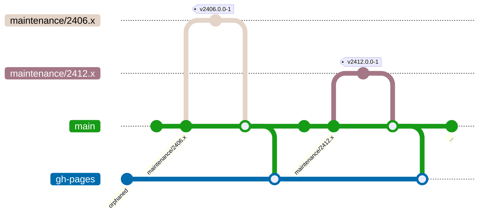

# Introduction

:::info
Starting in August 2025, we dropped the _Git Flow_ based process in favor
of having parallel maintenance version branches.
:::

:::tip TL;DR
For the following we use two scenarios:

* Release approval for _major_ version 2506.0 (starting from `main`).
* Release approval for _minor_ version 2406.1 (starting from `maintenance/2406.x`).
:::

This section will guide you through a typical development, approval and
release process. We will guide you in parallel through the approve and
release process for a CMCC major version, as well as for a CMCC minor version.

:::note NOTE: Powered by Mermaid
Each step will be guided by Git Graphs (powered by
[Mermaid](https://mermaid.js.org/ "Mermaid | Diagramming and charting tool")).
:::

For the following description, we expect the following starting points
regarding the Git and documentation perspective.

Thus, we have approved the GCC integration for (_major_) versions
CMCC v12.2406.0.0 and CMCC v12.2412.0.0.

:::info INFO: Deploy Documentation from Main
All documentation updates must eventually go to the `origin/main` branch, as
`gh-pages` will be only deployed from that branch.
:::

:::warning WARNING: Stick to CMCC Release Order
Approvals done on a given branch like `origin/main` must be performed in
the same order as releases in the CMS. Thus, if you happen to have a delay
in your approval process, and `2412.0.0` as well as `2506.0.0` need to be
approved, you must strictly stick to first approving `2412.0.0`.
:::
