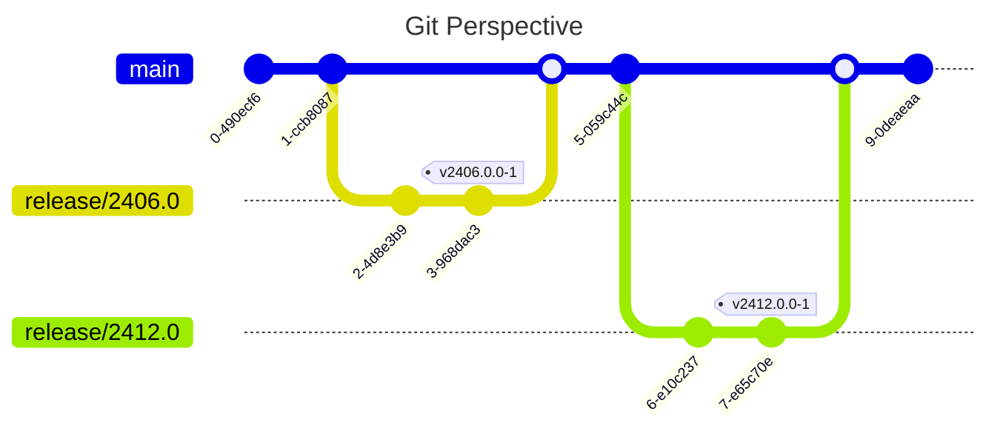

# Introduction

:::info
Starting in August 2025, we dropped the _Git Flow_  based process in favor
of having parallel maintenance version branches.
:::

:::tip TL;DR
For the following we use two scenarios:

* Release approval for _major_ version 2506.0 (starting from `main`).
* Release approval for _minor_ version 2406.1 (starting from `release/2406.0`).
:::

This section will guide you through a typical development, approval and
release process. We will guide you in parallel through the approve and
release process for a CMCC major version, as well as for a CMCC minor version.

Each step will be guided by Git Graphs (powered by
[Mermaid](https://mermaid.js.org/ "Mermaid | Diagramming and charting tool")).
As also the documentation contains a concept of _branches_
(see [Versioning | Docusaurus](https://docusaurus.io/docs/versioning)), Git
Graphs also exists for these, where applicable.

For the following description, we expect the following starting points
regarding the Git and documentation perspective.

Thus, we have approved the GCC integration for versions CMCC v12.2406.0.0 and
CMCC v12.2412.0.0. It is most likely, that the branch as well as the release
tag point to the same commit for now. We still create the maintenance
branches in advance to simplify approval of subsequent versions.

:::note
Yet to be defined is a process to later archive branches for no longer
supported versions (which, referred to CMCC release cycle refers to any
version as soon as it reaches _Extended Support_). The assumption is that
we will just delete the branches, as a corresponding release-tag should always
exist, that we can create the branch again from.
:::

As for the documentation we only create version specific documentation
for each major version, anonymized (`*.x`) versions got created for now.

:::info
All documentation updates must eventually go to the `origin/main` branch, as
`gh-pages` will be only deployed from that branch. For a minor release, this
requires to set up two branches for one approval process, that later need to
be merged to different targets.
:::

:::warning
Approvals done on a given branch like `origin/main` must be performed in
the same order as releases in the CMS. Thus, if you happen to have a delay
in your approval process, and `2412.0.0` as well as `2506.0.0` need to be
approved, you must strictly stick to first approving `2412.0.0`.
:::
