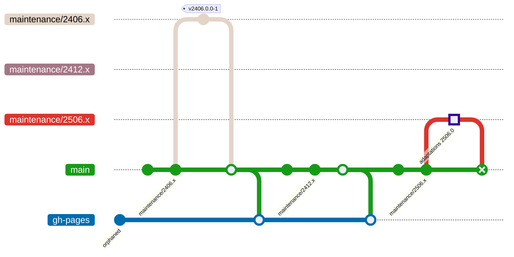
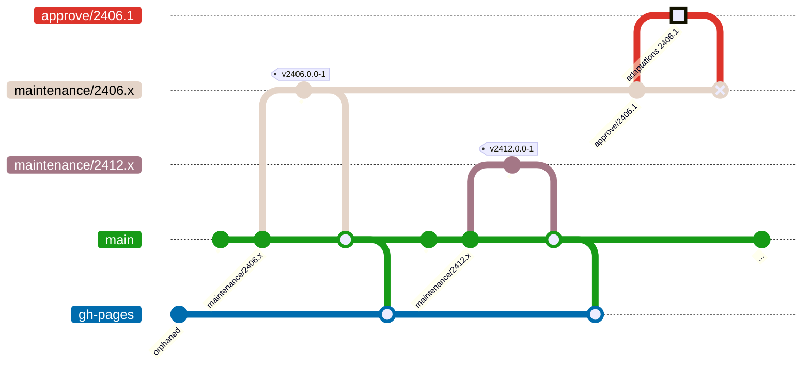
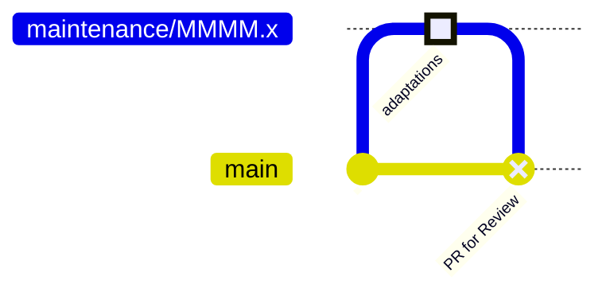

import Tabs from '@theme/Tabs';
import TabItem from '@theme/TabItem';

# Create Feature Branch for Approval

In the subsequent process we will distinguish a major release approval like
CMCC v12.2506.0.0 and a minor release approval like CMCC v12.2406.1.0.

<Tabs
  lazy
  defaultValue="major"
  values={[
    { value: "major", label: "2506.0" },
    { value: "minor", label: "2406.1" },
  ]}
>
<TabItem value="major">

</TabItem>
<TabItem value="minor">

</TabItem>
</Tabs>

:::info INFO: Merge Commit Representing GitHub Pull Request Base


The _merge commit_ used in the graphs is just to represent a base to
compare the changes with. This is suitable for reviewers, so that they get an
overview of the applied changes. Only PRs with base `main` will later be
merged.

It uses the _reverse_ commit type (shown as `X`) to signal, that it has not been
merged yet.
:::

For each new approval of a CMCC version, we need to apply updates to the GCC
repository (new API, new or updated dependencies and alike).

When starting the approval process, a new branch needs to be created from
either the `main` branch (for _major_ versions) or from the related
maintenance branch (for _minor_ versions).

<Tabs
  defaultValue="major"
  values={[
    { value: "major", label: "2506.0" },
    { value: "minor", label: "2406.1" },
  ]}
>
<TabItem value="major">
```bash
git switch --create --track "maintenance/2506.x" "origin/main"
```
</TabItem>
<TabItem value="minor">
```bash
git switch --create --track "approval/2406.1" "origin/maintenance/2406.x"
```
</TabItem>
</Tabs>

In general all adaptations are done on an `approval/*` branch, which is later
reviewed, merged and deleted. We simplify the process for _major_ releases by
using the `maintenance/*` branch directly.

:::caution CAUTION: Protect Branches
If creating new maintenance branches, you should mark them as protected branches
in GitHub, so that they are not deleted by accident when later merged back to
main again (as one-time merge only).
:::
