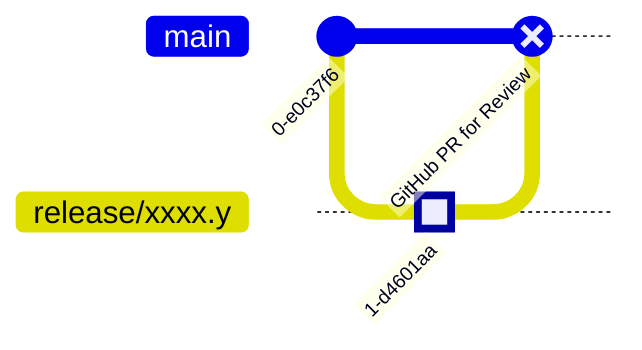

import Tabs from '@theme/Tabs';
import TabItem from '@theme/TabItem';

# Create Feature Branch for Approval

:::tip TL;DR
Create a feature branch from the _closest_ release branch. For review
(and to track your changes), create a PR towards the base branch, while only
branches branched off from `main` will later be merged.
:::

<Tabs
  lazy
  defaultValue="major"
  values={[
    { value: "major", label: "2506.0" },
    { value: "minor", label: "2406.1" },
  ]}
>
<TabItem value="major">

</TabItem>
<TabItem value="minor">

</TabItem>
</Tabs>

:::info Merge Commit Representing GitHub Pull Request Base



For now the _merge commit_ used in the graphs is just to represent a base to
compare the changes with. This is suitable for reviewers, so that they get an
overview of the applied changes. Only PRs with base `main` will later be
merged.
:::

For each new approval of a CMCC version, we need to apply updates to the GCC
repository (new API, new or updated dependencies and alike).

All adaptations are done on an _approval feature-branch_ that in general is
never merged back to its originating branch (only exception for approval
branches, that started from `main`). As we will keep the branch after the
approval/release, we just use `release/*` as a prefix.

<Tabs
  lazy
  defaultValue="major"
  values={[
    { value: "major", label: "2506.0" },
    { value: "minor", label: "2406.1" },
  ]}
>
<TabItem value="major">
```bash
git switch --create --track "release/2506.0" "origin/main"
```
</TabItem>
<TabItem value="minor">
```bash
git switch --create --track "release/2406.1" "origin/release/2406.0"
git branch --track "documentation/2406.1" "origin/main"
```
</TabItem>
</Tabs>

**Documentation Branch:** When approving/releasing a minor version, a parallel
documentation branch `documentation/xxxx.y` needs to be created. This is
because documentation changes are only relevant on the `main` branch.

For major approval/release we can skip this extra branch, as adaptations to
the code as well as to the documentation are both meant to be merged to
`main` eventually.
