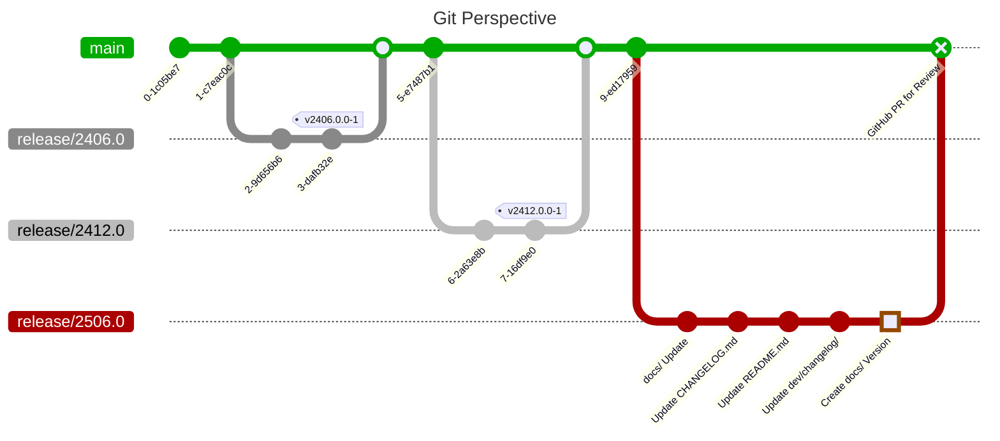

import Tabs from '@theme/Tabs';
import TabItem from '@theme/TabItem';

# Documentation Update

:::tip Mj/Mn
Steps required for major version approvals are marked with **Mj** while
steps required for minor version approvals are marked with **Mn** to ease
browsing the table of contents. Steps that are optional for minor
version approvals are marked with a lower-cased **mn**.
:::

:::info
The documentation is deployed to an extra branch `gh-pages`. It is generated
by [Docusaurus](https://docusaurus.io/) and located within the `website/`
folder of this repository.

Deployment is done automatically from `main` branch, as soon as changes have
been merged.
:::

The documentation below `website/` comes in two parts. While `website/dev/`
contains unversioned documentation related to this repository (like this
section here), `website/docs/` contains the so-called _versioned documentation_.
This section is about updating the latter.

:::info
In general documentation in the versioned part is not updated. Exceptions
may apply and some known exceptions are listed below.
:::

<Tabs
  lazy
  defaultValue="major"
  values={[
    { value: "major", label: "2506.0" },
    { value: "minor", label: "2406.1" },
  ]}
>
<TabItem value="major">

</TabItem>
<TabItem value="minor">

</TabItem>
</Tabs>

:::warning Updates to Main Branch
All documentation updates are only eventually applied to the `main` branch.
For **major version** approvals, this can be done directly on the branch used
for approval. For **minor version** approvals, it must be done on an extra
branch.
:::

## a) CoreMedia Documentation Links (Mj, Mn)

Search for occurrences of `documentation.coremedia.com` and ensure that the
version referenced is aligned with the version to approve.

:::warning Restrict Update Location
For this update, you must distinguish between a major and a minor version
approval:

* **Major:** Search and replace in `docs/` folder.

* **Minor:** Search and replace in the respective subfolder of
  `versioned_docs/version-2406.x`.
:::

## b) Content Revision (Mj, Mn)

On each CMCC version update, we need to check if the documentation for
administrators, editors and developers are still aligned with the product.

Unless we introduced new behaviors to the GCC integration, or the integration
into CoreMedia Blueprint has to be adapted, there is nothing to be done here
most of the time.

## c) Screenshot Revision (Mj, mn)

:::info Skip for Minor Release Approval
Unless it is about documenting new features or behaviors, aligning screenshots,
for example, to a new visual identity of CoreMedia, should just be considered
for approval of new major versions.
:::

The section _"Editors"_ contains screenshots, that may require an update.
Consider reading the corresponding [How-to](/dev/howto/screenshots) to guide
you through the process (like resolutions to choose, etc.).

## d) Third-Party Reports (Mj)

:::info Skip for Minor Release Approval
As our automation targets the `docs/` folder, it cannot be used without
additional effort for updating the third-party report for minor release
approvals.

For simplicity, and as we expect only a few changes, we **skip this step
for minor release approvals.**
:::

Used third-party libraries must be reported and their licenses integrated into
the documentation (as at least some licenses require this). We only maintain
these reports for our Maven/Java based modules.

To create a new report:

* Ensure to have built the CMCC branch before (as most dependencies will be
  taken from corresponding parents or BOMs).

* Run:

  ```bash
  mvn -Pdocs-third-party generate-resources
  ```

  This will update the auto-generated file
  `website/docs/third-party/third-party.md` as well as adding downloaded
  licenses to `website/docs/third-party/files`.

  :::info
  For generating the Markdown report `third-party.md` the FreeMarker template
  `src/main/templates/third-party-md.ftl` is used.
  :::

## e) Add Changelog Entry (Mj, Mn)

The release notes at
[GitHub/Releases](https://github.com/CoreMedia/coremedia-globallink-connect-integration/releases)
and in
[CHANGELOG.md](https://github.com/CoreMedia/coremedia-globallink-connect-integration/blob/main/CHANGELOG.md)
typically represent just an excerpt of all changes applied.

A more verbose changelog is maintained at `website/dev/changelog`. Add
a corresponding file to represent the new version.

:::info
**Unversioned Documentation:** This changelog is maintained in the _unversioned_
documentation area of Docusaurus at `website/dev`.
:::

## f) Update CHANGELOG.md (Mj, Mn)

As an excerpt of the previous changes (and as main entry-point), update
[CHANGELOG.md](https://github.com/CoreMedia/coremedia-globallink-connect-integration/blob/main/CHANGELOG.md).

These entries will later be used for the release note at
[GitHub/Releases](https://github.com/CoreMedia/coremedia-globallink-connect-integration/releases).

## g) Update README.md (Mj, mn)

:::info Optional for Minor Release Approval
On the `main` branch, we always only represent the most recent versions.
For consistency, you may consider adapting the `README.md` on the corresponding
`release/*` branch. But it is totally optional.
:::

Update version badges at:
[README.md](https://github.com/CoreMedia/coremedia-globallink-connect-integration/blob/main/README.md).

## h) Create Version Snapshot (Mj)

:::info Skip for Minor Release Approval
For simplicity, and as it is aligned with the best practices for
using versioned documentation in [Docusaurus](https://docusaurus.io/), we only
create _anonymized_ snapshot versions for each major approval.

Thus, for the `2406.1` approval, we applied our updates to `version-2406.x`,
so that we do not need to create a new version snapshot.
:::

Late in the approval and release phase (best: after everything got reviewed)
you create a new version snapshot of the documentation. As we will do so only
for every major release approval, we use _anonymized_ versions, thus, ending
with `.x`.

For the given example of the 2506.0.0 approval, call:

```bash
pnpm run version-snapshot 2506.x
```
