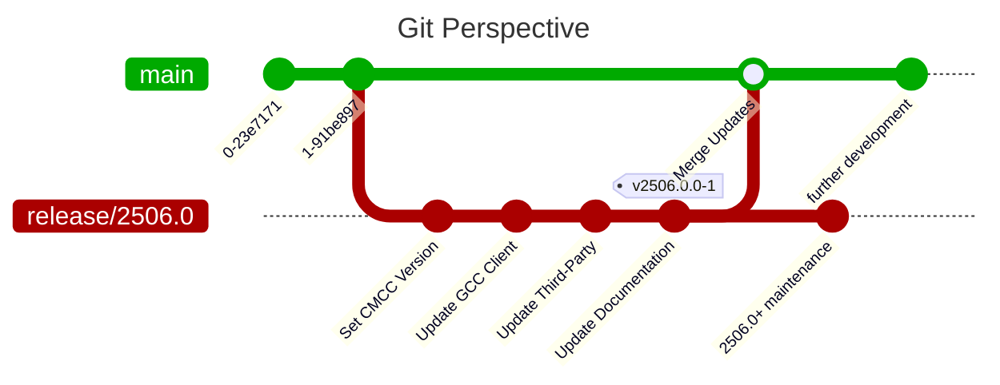

import Tabs from '@theme/Tabs';
import TabItem from '@theme/TabItem';

# Merge Changes

After successful review of the applied changes, you have to merge at least one
branch to `main`.

## Branch Overview

Given the
[original branch setup](./01-create-branch.mdx) we started with, the next
steps for persisting the changes is illustrated in the following Git graph.

<Tabs
  lazy
  defaultValue="major"
  values={[
    { value: "major", label: "2506.0" },
    { value: "minor", label: "2406.1" },
  ]}
>
<TabItem value="major">

</TabItem>
<TabItem value="minor">

</TabItem>
</Tabs>

## Git Steps

Thus, for a **major release** approval we merge the branch _once_ to `main`,
but keep the branch for later maintenance releases.

For a **minor release** we just merge the documentation updates, keeping the
created release branch unmerged as is for later maintenance.

In both scenarios, the release tag will be applied to the release branch only.

Git commands to create the corresponding release tag:

<Tabs
  defaultValue="major"
  values={[
    { value: "major", label: "2506.0" },
    { value: "minor", label: "2406.1" },
  ]}
>
<TabItem value="major">
```bash
git switch "release/2506.0"
git tag "v2506.0.0-1"
git push origin "v2506.0.0-1"
```
</TabItem>
<TabItem value="minor">
```bash
git switch "release/2406.1"
git tag "v2406.1.0-1"
git push origin "v2406.1.0-1"
```
</TabItem>
</Tabs>

## Automatic Documentation Deployment

As soon as the documentation update is merged, it is deployed to the
[gh-pages branch](https://github.com/CoreMedia/coremedia-globallink-connect-integration/tree/gh-pages).

The corresponding actions may also be triggered manually at any time within the
[GitHub Actions](https://github.com/CoreMedia/coremedia-globallink-connect-integration/actions).
