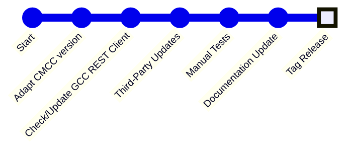

import Tabs from '@theme/Tabs';
import TabItem from '@theme/TabItem';

# To be continued...

Not yet adapted parts.

## Review Approval Adaptations

## Merge Approval Adaptations

## Create Tag for the Release



Now that you have updated the documentation, the third-party reports, the
changelog, and the version badges, you can proceed with creating the tag.

```bash
$ git checkout main
$ git merge "origin/develop"
$ git push origin main
$ git tag "v2406.1.0-1"
$ git push origin "v2406.1.0-1"
```

Alternatively, for a more transparent review process, create a PR from `develop`
to `main`. In this case, you can skip the first three steps. The reviewer gets
an overview of the recent changes on GitHub, and the PR can be directly merged
after approval.

## 6. Create GitHub Release

* Create a GitHub release from the tag, and the copy the changelog entries to
  the release description. Please use the same pattern for release title as the
  previous releases.
* Review GitHub issues and possibly adjust state.

## Sketch: Incorporating Pull Requests for Given CMCC Versions

If customers want to provide a patch for a given workspace version, create
a branch from the given tag. This will then receive the PR results. If
applicable to current `develop` branch, cherry-pick the PR commits to
`develop` branch.
