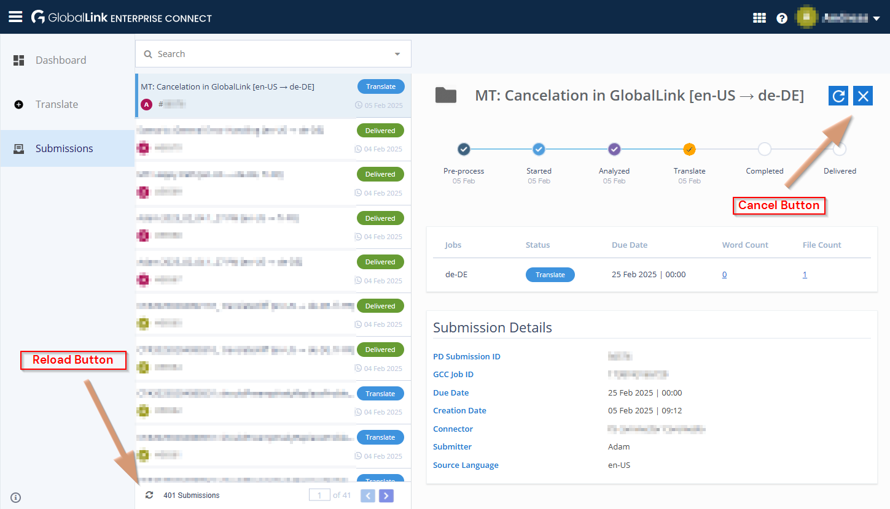

# Cancelation

* **Connector Type**: `default`
* **Key Type**: `manual`

:::tip TIP: Cancelation vs. Cancellation
GlobalLink uses "Cancellation", but according to Miriam Webster, which is our
go-to source for spelling, "Cancelation" is better to be used in American
English – while both are valid.

**Source:** [Merriam-Webster: Cancelled or Canceled - Which is Correct?](https://www.merriam-webster.com/grammar/canceled-or-cancelled)
:::

## Cancelation in Studio

1. Log in as Rick C.

2. Open the GlobalLink
   settings `/Settings/Options/Settings/Translation Services/GlobalLink`

    1. `type` is set to `default`
    2. Credentials for gcc are entered (**manual** workflow key)

3. Start a translation for an article.

4. Select the started translation in the control-room.

5. Click the “X” in the header bar and confirm the dialog.

6. Open the "Closed" area in the Workflow App.

7. Wait for the translation process to appear in "Closed".

8. Check:

   1. The “Status” field should display “Canceled”
   2. The icon should mark the workflow as canceled (little “x” on the bottom right)

## Cancelation in GlobalLink

1. Log in as Rick C.

2. Open the GlobalLink
   settings `/Settings/Options/Settings/Translation Services/GlobalLink`

   1. `type` is set to `default`
   2. Credentials for gcc are entered (**manual** workflow key)

3. Start a translation for an article.

   It is recommended to set a distinguishable name for the workflow, to better
   locate in the next step.

4. Log in to the _GlobalLink Management Dashboard_ and cancel the workflow.

   The "Cancel" button used to be in the upper right corner of the opened
   submission.

   

5. Go back to the _Workflow App_

   1. After a while, the workflow should appear in Rick's "Open" workflows
   2. When accepting the task, Rick can only choose to abort and rollback the
      previous changes and accept the cancelation.
   3. Choose "Abort and rollback changes".

6. Open the "Closed" area and open the canceled workflow.

   1. Field “Status” should display “Canceled”
   2. The icon should mark the workflow as canceled (little “x” on the
      bottom right)

## Cancelation Error Handling

The following test is about the error handling of a cancelation, as well as it
includes testing UI behaviors for multi-selection.

1. Log in as **Rick C**.

   Required to use Rick C here, as Adam, for example, will not be able to do the
   multi-selection test, as local translations will appear in "Open" section for
   Adam.

2. Open the GlobalLink
   settings `/Settings/Options/Settings/Translation Services/GlobalLink`

   1. `type` is set to `default`
   2. Credentials for gcc are entered (**manual** workflow key)

3. Start three translation workflows for the same article:

   1. Start a GlobalLink Translation Workflow two times.
   2. Start a default Blueprint translation workflow.

4. **Control Room**: Check the multi-selection behavior of the "X" in the
   header bar:

   1. If all selected translations are of type "GlobalLink", the "X" should be
      visible and activated.
   2. If one of the selected translations is not of type "GlobalLink", the "X"
      should be hidden.

5. **Workflow App**: Check the "X Cancel" option in the "Running" section of the
   Workflow App:

   1. If all selected translations are of type "GlobalLink", the "X" should be
      visible and activated.
   2. If one of the selected translations is not of type "GlobalLink", the "X"
      should be hidden.

6. **Break it**:

   Consider to temporarily change the `globalLink.retryCommunicationErrors` to
   `2` to give you more time (120 seconds) to proceed with the next steps.

   Prepare to change, for example `globalLink.apiKey` to some invalid value like
   adding a `-` (minus) as first character. This will cause subsequent calls to
   GlobalLink to fail.

   Before that, either have your control-room open, or the workflow app in an
   extra window. For a single-screen setup, it is recommended to use the
   control-room.

   **Do it**: Now, break the connection to GlobalLink by changing the `apiKey`.

7. **Speed Mode, Step 1**: Select both "Translation with GlobalLink" workflows
   and click the “X”. Acknowledge the dialog to proceed the cancelation.

8. **Speed Mode, Step 2**: Check that already now, the "X" button/menu-entry
   is disabled.

   **You may calm down now, as the following steps are not time-critical.**

9. **Workflow App**: Open one of the workflows.

10. Wait for the workflow to reach the task named "Cancelation error".

11. Validate the following:

    1. The "Current Task" field should display "Cancelation Error".
    2. The "Status" field should display "Canceled".
    3. The icon should signal a warning.

12. Click "Accept Task" and "Next Step"

    1. Validate options, that should be available:

       1. Abort and rollback without canceling at GlobalLink
       2. Retry cancelation
       3. Continue translation

    2. Click "Abort and rollback without canceling at GlobalLink" and open the
       target site's document

       1. The document should remain in its previous version.

    3. Go back to the _Workflow App_ overview

       1. The workflow should be moved from the "Running" to the "Closed" list
       2. The “Status” field in _Workflow App_'s overview should display
          “Workflow completed”
       3. The icon should mark the workflow as canceled (little “x” on the
          bottom right)
