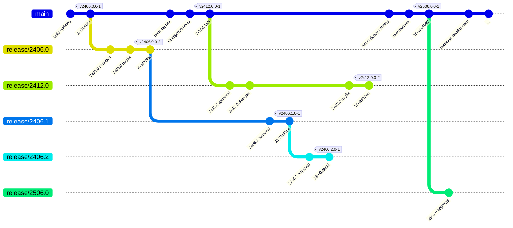

# Branches

* **main:** The primary development branch where ongoing work for future releases
  takes place. All new feature development and pull requests should target this
  branch. New major release branches (e.g., `release/2406.0`, `release/2412.0`)
  are created from `main` when a new major version of the underlying platform
  needs to be prepared. Documentation deployment to GitHub Pages happens only
  from this branch, which maintains all versioned documentation.

* **release/YYYY.V:** Version-specific release branches created for each major/minor
  version of the underlying platform. The first release branch for a major version
  (e.g., `release/2406.0`) is created from `main`. Subsequent minor release branches
  within the same major version (e.g., `release/2406.1`, `release/2406.2`) are
  created from the previous release branch of that major version, forming a chain.
  These branches receive approval-specific changes, dependency updates, and API
  adaptations. Repository versions are tagged with the format `vYYYY.V.P-N`, where
  `N` is the repository-specific version number (typically `-1`, but incremented
  to `-2`, `-3`, etc. for bug fixes within the same platform version). Once a
  newer minor version branch is created, the previous branch may be discontinued.

:::note

Until approval of 2406.1.0 and 2412.0.0 we stick to a Git-Flow process. Starting
with 2406.2.0 in August 2025, we changed to this new branching model. That is
why the actual branches may not match the graph above.

:::
