# Branches

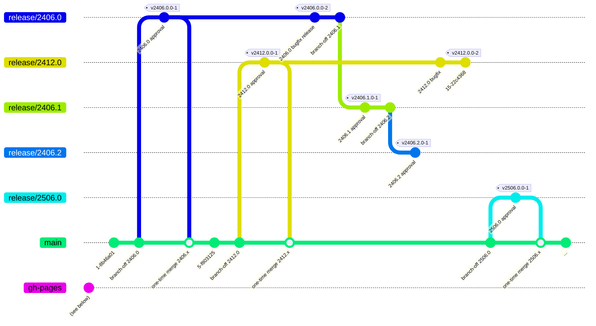

* **main:** The primary development branch where ongoing work for future releases
  takes place. All new feature development and pull requests should target this
  branch. New major release branches (e.g., `release/2406.0`, `release/2412.0`)
  are created from `main` when a new major version of the underlying platform
  needs to be prepared. Documentation deployment to GitHub Pages happens only
  from this branch, which maintains all versioned documentation.

* **release/YYYY.V:** Version-specific release branches created for each major/minor
  version of the underlying platform. The first release branch for a major version
  (e.g., `release/2406.0`) is created from `main`. Subsequent minor release branches
  within the same major version (e.g., `release/2406.1`, `release/2406.2`) are
  created from the previous release branch of that major version, forming a chain.
  These branches receive approval-specific changes, dependency updates, and API
  adaptations. Repository versions are tagged with the format `vYYYY.V.P-N`, where
  `N` is the repository-specific version number (typically `-1`, but incremented
  to `-2`, `-3`, etc. for bug fixes within the same platform version). Once a
  newer minor version branch is created, the previous branch may be discontinued.

* **gh-pages:** An orphaned branch used to publish GitHub Pages website. For
  details and how it interacts with the release/approval process, see the
  [Documentation section](./documentation.md).

:::note
Until approval of 2406.1.0 and 2412.0.0 we stick to a Git-Flow process. Starting
with 2406.2.0 in August 2025, we changed to this new branching model. That is
why the actual branches may not match the graph above.
:::

## Branch Lifecycle Example

The following example is based on the order of releases that were executed in
the past, while the process as described here was not implemented. It shall
illustrate, how to work with the new approach.

### New Suggested Variant

#### 2406.0.0 Approval Phase

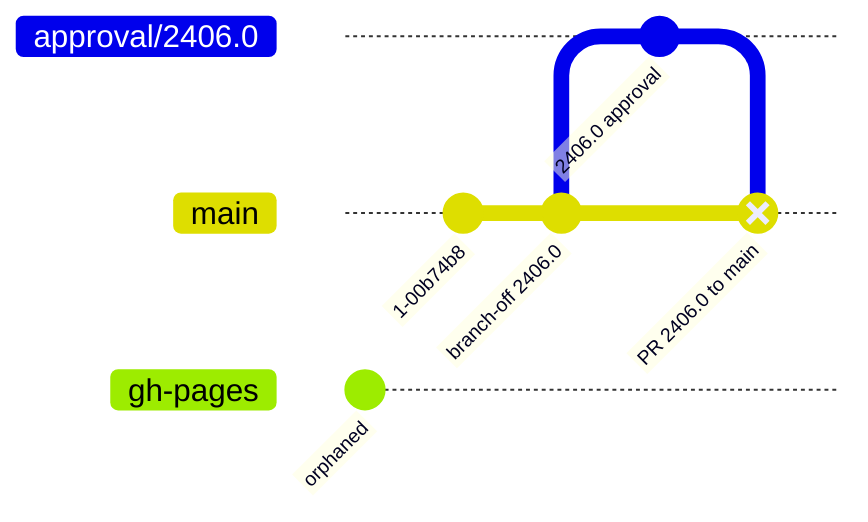

The merge commit signals a yet unmerged pull-request with base branch `main`.
This is used to review the changes prior to merging them.

#### 2406.0.0 Release Phase

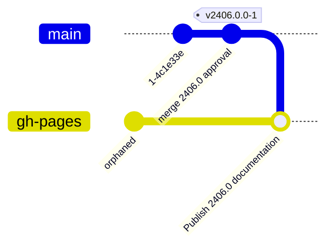

The approval branch for 2406.0 is deleted, tag is applied for merge branch on
main. Documentation is published directly from merged results.

#### 2406.1.0 Approval Phase

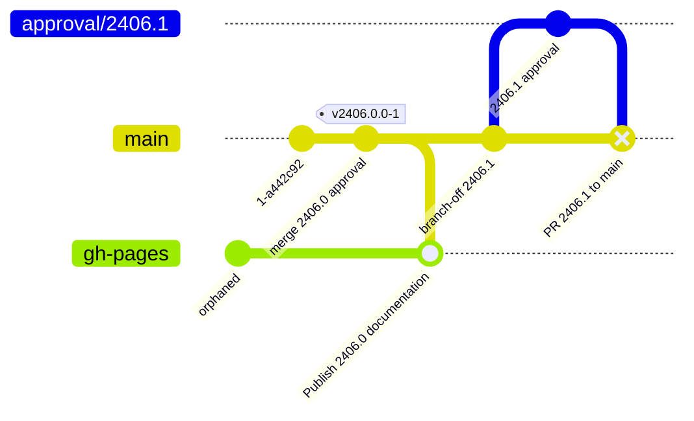

As we have no intermediate _major_ release, we can just continue from `main`
to also approve the minor version increment.

#### 2406.1.0 Release Phase

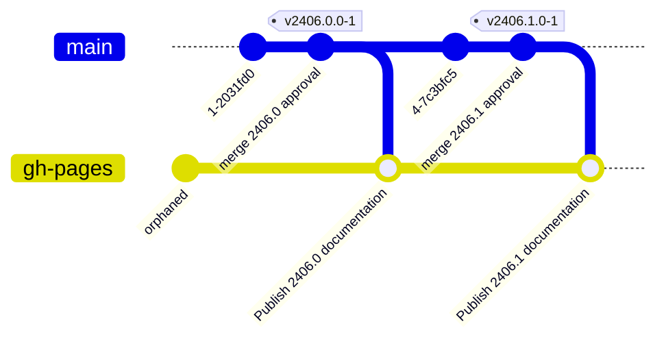

The approval branch for 2406.0 is deleted, tag is applied for merge branch on
main. Documentation is published directly from merged results.

#### 2412.0.0 Approval Phase

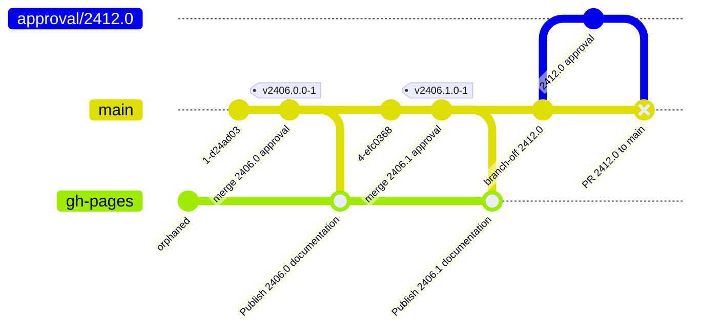

Same as before, we can just start from main brain.

#### 2412.0.0 Release Phase

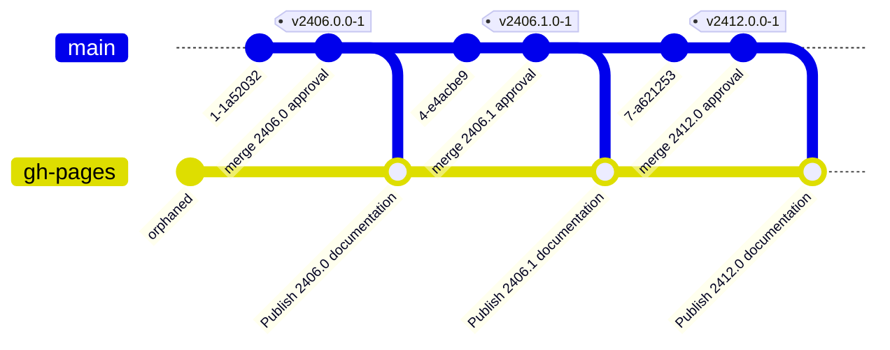

The approval branch for 2406.0 is deleted, tag is applied for merge branch on
main. Documentation is published directly from merged results.

#### 2406.2.0 Approval Phase

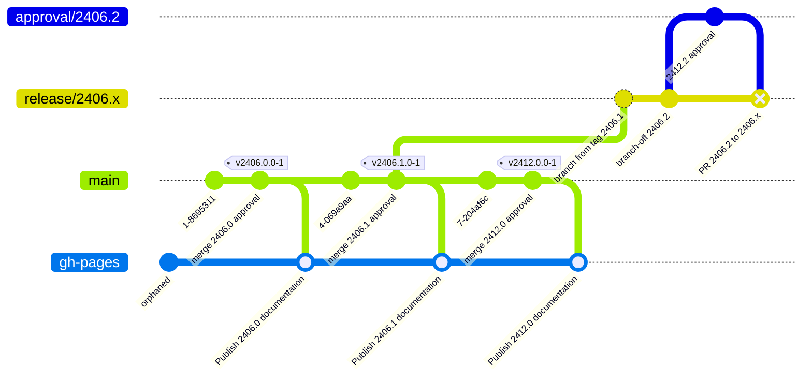

New we have to deviate from the standard pattern. We need to create a
"long(er) living" release branch from the previously released 2406.1
approval as a new base for our 2406.2 approval.

We may name it `release/2406.1`, but this would cause subsequent mismatches
where the `2406.2` release tag is eventually applied. Naming it `release/2406.x`
seems to be the better name, thus, to have a wildcard in the branch name. It
means: Any subsequent release with base `2406.*` will now be released from here.

#### 2406.2.0 GCC Adaptation

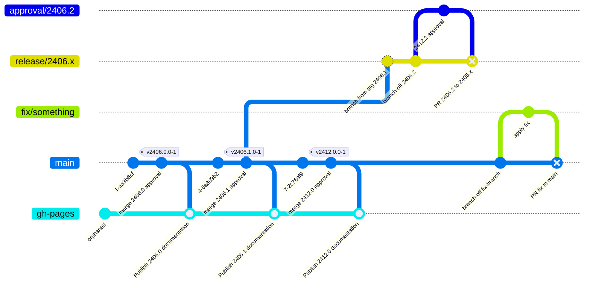

An extra twist into the story: We want to change the behavior of the GCC
integration (this can also be an update of the GCC REST client), to be released
with 2406.2 approval for the first time.

We could apply it on the `approval/2406.2` branch and cherry-pick it later to
`main`. The better approach, though, seems to apply this change to `main` and
later pick to the approval branch.

#### 2406.2.0 GCC Adaptation Merge & Pick

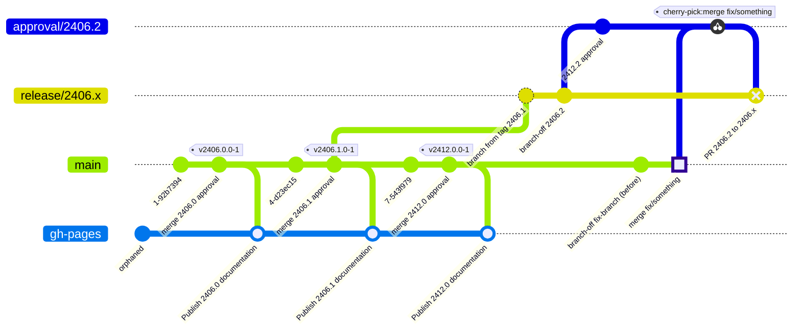

We now merge this fix commit (and delete the fix-branch) and cherry-pick the
change to our approval branch.

#### 2406.2.0 GCC Adaptation – An Alternative History

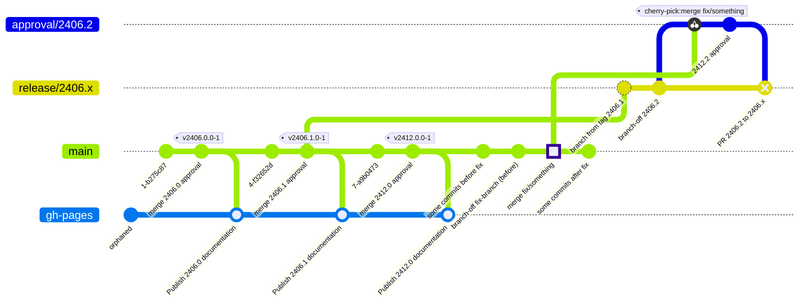

In this history, we decided much later, that we want to have a 2406.2 branch.
**We must not forget to now pick all relevant fix commits from `main` to
the new to-be-released branch.**

As alternative to this: As soon as we fix something, that may be relevant for
later releases, we create the corresponding `release/*` branches then, so that
we do not forget about them.

#### 2406.2.0 Release Phase

Continue with the original story for 2406.2.0

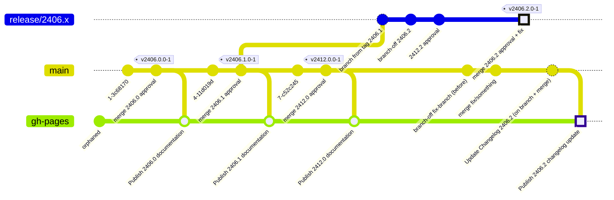

We now have the first release-tag on a `release/*` branch. It is also the first
time, that we need two parallel (or closely following) branches, one for merging
the approval to the release branch, one for updating the changelog in the
documentation.

**Unanswered Changelog:** Do we want to apply the changelog entry also to the
`2406.2` release, or is it enough just to have it on `main` and thus
published to `gh-pages`?
