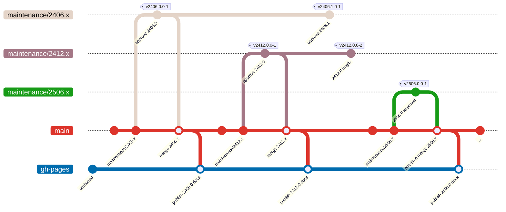

# Branches

Overview of Branches `main`, `maintenance/MMMM.x` and `gh-pages`.

## Branch Overview

## Branch Details

### main

The primary development branch where ongoing work for future releases takes
place. All new feature development and pull requests should target this branch.
New major release branches (e.g., `maintenance/2406.x`, `maintenance/2412.x`)
are created from `main` when a new major version of the underlying platform
needs to be prepared.

### maintenance/MMMM.x

Major Version specific release branches created for each major version of the
underlying platform. It is created as soon as the approval for the next major
version starts.

Approvals for minor version within the same major version (e.g., `2406.1`,
`2406.2`) are created from the respective `maintenance/MMMM.x` branch. These
branches receive approval-specific changes, dependency updates, and API
adaptations.

Release tags are always applied to maintenance branches only.

Bug fix releases (in context of issues within this integration) typically
increase the last digit of the tag (e.g., `v2406.0.0-2`, `v2406.0.0-3`).

### gh-pages

An orphaned branch used to publish GitHub Pages website. For details and how it
interacts with the release/approval process, see the
[Documentation section](./documentation.md).

## Previous Branch Model

Until approval of 2406.1.0 and 2412.0.0 we stick to a Git-Flow process. Starting
with 2406.2.0 in August 2025, we changed to this new branching model. That is
why the actual branches may not match the graph above.
