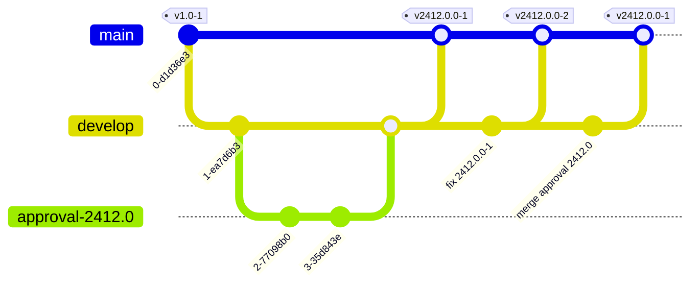

# Branches

* **main:** Will be initially used to create `develop` branch. Afterward, it
  will just be used to merge changes from `develop` branch to `main`, i.e., it
  will just be recipient afterward. On _release_ the main merge commit will be
  tagged. See below for details on tagging.

* **develop:** After initial creation, all development by CoreMedia and merging
  pull request will happen here. Also, any pull requests for adjustments should
  have set this as the base branch.
