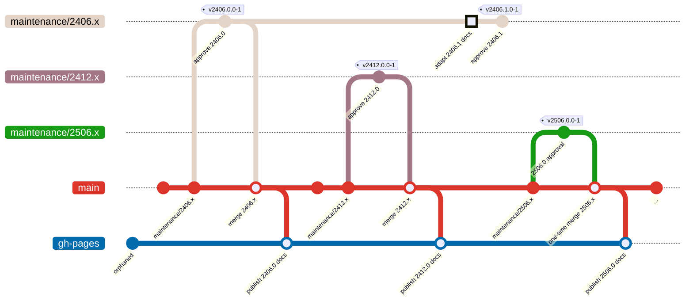

# Documentation

This project uses [Docusaurus](https://docusaurus.io/) for generating and
deploying documentation as static HTML files to GitHub pages.

## Documentation Workflow

The following diagram shows how documentation versions are managed and deployed:



The documentation is always only deployed from the `main` branch (performed
automatically by GitHub actions).

## Previous Versions

For any documentation for a given approved/released version, the documentation
site should be deployed locally for browsing:

```bash
cd website
pnpm install
pnpm start
```

## docs/ vs. dev/

<RepositoryLink path="website/docs/" /> contains version specific documentation,
while <RepositoryLink path="website/dev/" /> is not related to any version.
Thus, typically `dev/` is only maintained on `main` while `docs` is maintained
also on the maintenance branches.

## Changelogs

We maintain two changelogs:

* <RepositoryLink path="website/docs/changelog/" /> contains a changelog with
  many details like upgrade information.

* [Release Description](https://github.com/CoreMedia/coremedia-globallink-connect-integration/releases)
  is meant to contain an overview of the applied changes.

While the changelog within the website is only maintained for sequential
releases (thus, `maintenance/2406.x` only contains changes relevant for
`2406.0`, `2406.1`, etc.), the _Releases_ changelog provides an overview of all
releases.

As a result for the website, the changelog deployed to GitHub pages (published
from `main`) always only contains changes along major version approvals.

:::note NOTE: CHANGELOG.md
In August 2025 we dropped a central `CHANGELOG.md` at repository root. Instead
the releases must contain a corresponding changelog and a more detailed
changelog with upgrade information is maintained
at <RepositoryLink path="website/docs/changelog/" />.
:::

## Third-Party Reports

For each release/approval we also generate the third-party reports. Just as
for the changelogs, as GitHub pages is only deployed from `main`, the published
reports only contain the report for the latest approved major version.

For maintenance versions, we still update the third-party report, but it is
only available for repository or local browsing.
