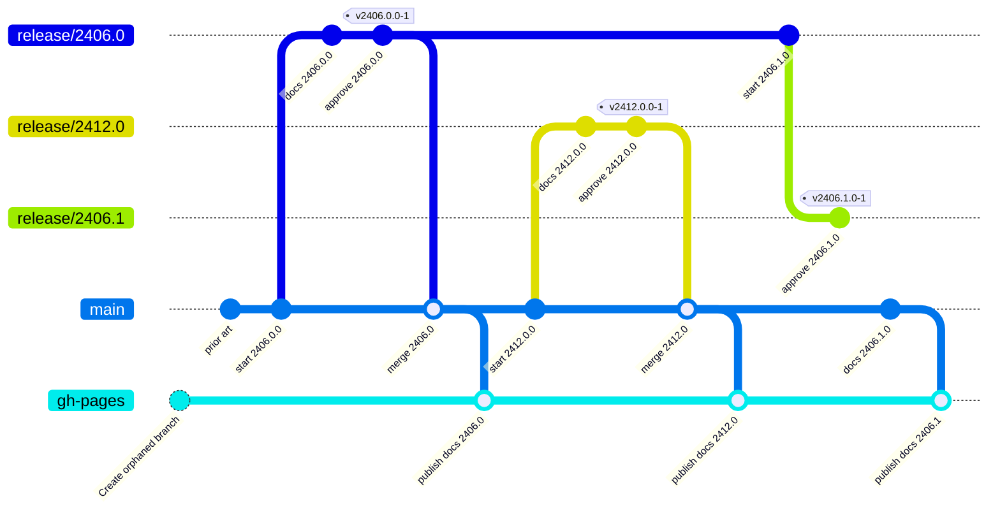

# Documentation

This project uses [Docusaurus](https://docusaurus.io/) for generating and
deploying documentation as static HTML files to GitHub pages.

:::note
While Docusaurus also provides the option to maintain multiple versions, we
dropped the idea in August 2025 to make use of this feature due to the
complexity of maintaining such a versioned documentation.
:::

## Documentation Workflow

The following diagram shows how documentation versions are managed and deployed:



The documentation is always only deployed from the `main` branch (performed
automatically by GitHub actions).

For releases based on minor version increments (like `v2406.1.0-1`) the
documentation itself is considered **_frozen_**. Changes for minor version
increments are never merged back to `main` again. **The only exception here:**
Changelog entries (`website/dev/changelog`) are always required to be applied
to `main`. It is up to you, if you just apply them to `main` or cherry-pick
them from the corresponding release branch.

## Documentation Versioning

As stated above, we do not use documentation versioning as provided as Opt-In
by Docusaurus. Instead for documentation of previous releases the recommended
approach is to switch to the corresponding version tag and locally deploy
the documentation for browsing:

```bash
cd website
pnpm install
pnpm start
```
