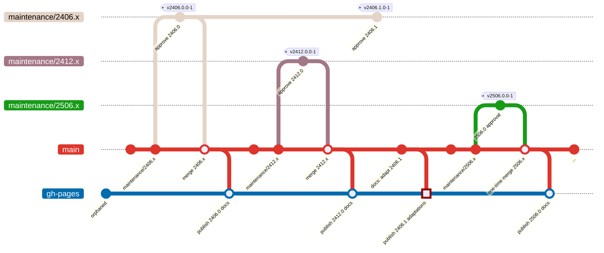

# Documentation

This project uses [Docusaurus](https://docusaurus.io/) for generating and
deploying documentation as static HTML files to GitHub pages.

## Documentation Workflow

The following diagram shows how documentation versions are managed and deployed:



The documentation is always only deployed from the `main` branch (performed
automatically by GitHub actions).

For releases based on minor version increments (like `v2406.1.0-1`) the
documentation itself is typically considered **_frozen_**. In other words:
expect no changes to `website/` folder on maintenance branches after the first
approval of the major version.

Do not forget, though, to update the changelog on the `main` branch also for
minor release approvals (as can be seen for highlighted publication named
_publish 2406.1 adaptations_).

:::info INFO: Option to Adapt Maintenance Branches
You are free to decide to still adapt the documentation also on maintenance
branches for more relevant changes. For a specific version, customers of this
workspace may decide to browse it locally via `pnpm start`.
:::

## Documentation Versioning

We do not use documentation versioning as provided as opt-in by Docusaurus.
Instead for documentation of previous releases the recommended approach is to
switch to the corresponding version tag and locally deploy the documentation for
browsing:

```bash
cd website
pnpm install
pnpm start
```
