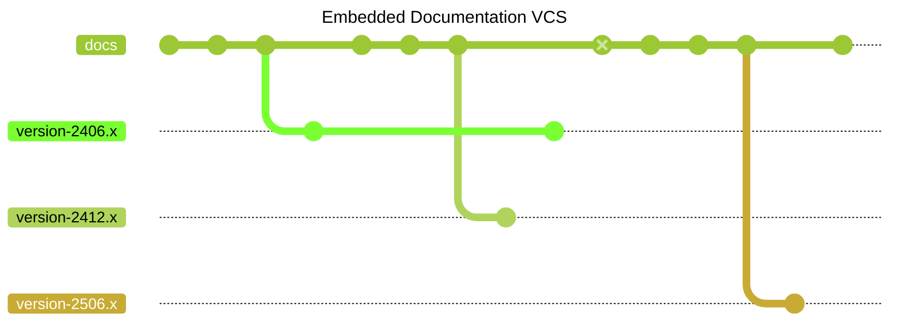

# Documentation

This project uses [Docusaurus](https://docusaurus.io/) for generating and maintaining versioned documentation. Docusaurus is a modern static website generator that's particularly well-suited for technical documentation with features like versioning, internationalization, and search.

## Documentation Workflow

The following diagram shows how documentation versions are managed and deployed:


## Documentation Versioning Strategy

### Major Version Documentation Only

Following Docusaurus best practices, we maintain versioned documentation only
for major versions (e.g., `2406.x`, `2412.x`, `2506.x`). This approach:

- **Reduces build complexity**:
  Each documentation version increases build time and bundle size
- **Simplifies maintenance**:
  Fewer versions to keep updated and consistent
- **Focuses on significant changes**:
  Major versions typically introduce substantial changes that warrant separate
  documentation

Think of this approach as just another _embedded Version Control System_. Thus,
on `main` the _documentation branches_ will look like this:



### Documentation Update Process

- **All documentation updates happen on `main`**: Whether fixing typos, updating
  procedures for new approvals (like `2406.1.0`), or adding new features, all
  changes must be made on the main branch.

  This includes updating the overview of used third-party via

  ```bash
  mvn -Pdocs-third-party generate-resources
  ```

  :::note
  This approach has a glitch: For updates on maintenance branches we will not
  (necessarily) update the used third-party overview (because all updates will
  just happen on the _main_ documentation branch). If you still want or need to
  update these reports, you have to manually apply them to the versioned
  documentation branch.
  :::

- **Release branches have static documentation**: Documentation sources on
  `release/` branches (e.g., `release/2406.0`, `release/2412.0`) are not
  maintained after creation. They serve only for building the specific version
  releases.

- **Versioned snapshots before major releases**: Before creating a new major
  release branch, a documentation version snapshot is created on main. This
  captures the documentation state for that major version.

- **GitHub Pages deployment from `main` only**: The `gh-pages` branch is updated
  exclusively from the main branch, which contains all version snapshots and
  serves as the single source of truth for documentation deployment.

### Benefits for Developers

This workflow ensures that:

- Documentation improvements benefit all relevant versions
- No need to cherry-pick documentation fixes across multiple branches
- Clear separation between code releases and documentation maintenance
- Consistent documentation experience across all deployed versions

:::info
The future is yet to be designed. The more versions we ship, the more complex
the documentation will get. The suggestion is to archive not maintained versions
later, like not only removing the corresponding `release/*` branch, but also
removing the versioned documentation. For now, refer to the official Docusaurus
documentation, how to proceed with this scenario (and think about updating
this documentation).
:::
