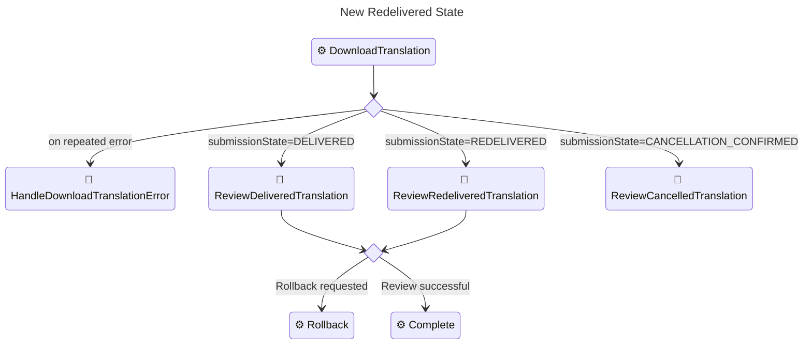

# GlobalLink Connect Cloud for CoreMedia Content Cloud v2406.1.0-1

Approve CMCC v12.2406.1.0, support state _Redelivered_.

## Summary

Despite adapting the connector to CoreMedia Content Cloud v12.2406.1.0, we
hardened the connector in these aspects:

* Introduced a defined behavior for the undocumented submission status
  `REDELIVERED`.
* Fixed submission instruction handling to deal with its features (HTML content)
  and limitations (character types).
* Fixed submission name handling to deal with its limitations (character types).
* Hardened the connector in case of submission errors (an extra state reachable
  in the GCC backend).
* Hardened the connector for "submission not found" scenarios that may occur
  due to wrong or connector key settings.
* Hardened `translation-global-link.xml` so that cancelation (as well as
  the new state to review a redelivered submission) can be reached even if
  the current download is in error.

## Upgrade Information 🆙

To benefit from new features like the handling of submission state
"Redelivered", the workflow definition must be uploaded again via `cm upload`.

Regarding the submission instruction handling, if you already handed over
instructions with HTML content by intention, you must adjust the setting
`globalLink.submissionInstruction.textTransform` from the default `text-to-html`
to `none`. `none` will suppress extra processing of the content of the
submission instructions, assuming, that both sides (workflow and GCC backend)
use the same text type.

For submission names and instructions, the new default behavior is to assume
that the REST backend only supports characters within the Unicode Basic
Multilingual Plane (BMP). If you connect to different backends, that support
the full range of Unicode characters, you may configure this individually
for submission names and instructions. Available default settings:

```yaml
globalLink:
  submissionInstruction:
    characterType: bmp
    characterReplacementStrategy: unicode-code-point
  submissionName:
    characterType: bmp
    characterReplacementStrategy: underscore
```

For a full Unicode support in backend change this to:

```yaml
globalLink:
  submissionInstruction:
    characterType: unicode
    characterReplacementStrategy: none
  submissionName:
    characterType: unicode
    characterReplacementStrategy: none
```

Note, that the `characterReplacementStrategy` is irrelevant for `unicode`
and can just be skipped.

## Improvements 💪

### Submission State `REDELIVERED`

The extension now supports a submission state _Redelivered_. Its handler is a
possible successor of `DownloadTranslation`/`CheckDownloadTranslation`. It is
assumed to represent a stage, where, for example, the XLIFF was corrupted. A
subsequent fix by the translation agency is shipped by extra means (via email,
for example).

Instead of the standard review process triggered by the user-task
`ReviewDeliveredTranslation` an alternative review process
`ReviewRedeliveredTranslation` is triggered.

The Editorial Quickstart got extended by this extra state, as it may not only
require reviewing the translation results, but to also upload the XLIFF via
CoreMedia Studio.



### Switch `CheckDownloadTranslation` Adjusted

A new branch for the state _Redelivered_ got added, that spawns an extra
user-task.

Also, the handling of errors has been made the last option. This fixes
scenarios, where you canceled a submission which already contains broken XLIFF,
just as it is required to robustly manage the _Redelivered_ state.

### Widened XLIFF Download

Especially as the assumed to be corrupted XLIFF may be also relevant for
reviewing the results after reaching submission state _Redelivered_, the XLIFF
file (along with issue information) can now be downloaded for both review tasks.

### Hardened Wrong or Invalid Connector Key Settings

Changing a connector key to an invalid or wrong key (if you have multiple keys
available) may have caused translation workflows to iterate endlessly instead of
triggering a user-task to deal with the observed unexpected state.

The change is twofold:

* For invalid keys you now get an early exception.
* For wrong keys, which may result in previous submission not being able to be
  retrieved anymore the unexpectedly disappeared submission is detected, and a
  subsequent exception is raised.

Both scenarios, if applied to a running workflow, will cause an error-handling
user-task to be triggered so that you may eventually fix your settings.

### Hardened Submission Error Handling

Submissions in the GCC Backend may reach an error state. While in previous
releases of the connector this would have caused endless waiting within the
workflow processing, such an error state is now correctly detected and triggers
the usual error-handling behavior (extra user-task).

### Hardened Towards Characters Outside of Unicode Basic Multilingual Plane

Submission instructions as well as submission names must not contain characters
outside the Unicode Basic Multilingual Plane (BMP). The connector now
provides options to handle such characters. The default behavior varies for
the corresponding submission properties:

* **Instructions**: By default, the connector will replace characters outside
  the BMP with its Unicode Code Point (`U+1F426` for a Dove Emoji, for example).
* **Name**: By default, the connector will replace characters outside the BMP
  with an underscore (`_`).

Both behaviors can be adjusted by settings:

```yaml
globalLink:
  submissionInstruction:
    characterType: bmp
    characterReplacementStrategy: unicode-code-point
  submissionName:
    characterType: bmp
    characterReplacementStrategy: underscore
```

### Hardened for Submission Not Found Errors

If your GCC account provides multiple connectors, it may happen that due to
a wrong connector key setting, a submission is not found anymore. This state
now raises an error, and subsequently triggers the usual error-handling.

### Hardened Error Handling in Workflow Definition

The workflow definition `translation-global-link.xml` has been hardened to
ensure that the cancelation (as well as the new state to review a redelivered
submission) can be reached even if the current download is in error.

The corresponding `<Case>` in the switch statements `CheckDownloadTranslation`
and `CheckCancelTranslation` have been moved to last position, so that
other states are checked first.

### Updated Editorial Quick-Start Screenshots

Along with adding a new screenshot for the _Redelivered_ state handling, also
updated all other screenshots to the most recent UI in CMCC v12.2406.1.0.

### New Error Codes

According to the various additions in context of exception handling, the
following new error codes are available and have been localized for use in
CoreMedia Studio:

| Error Code     | Localization (en)                                                                     |
|----------------|---------------------------------------------------------------------------------------|
| `GCC-WF-40003` | The given connector key in the GlobalLink configuration is invalid (property: 'key'). |
| `GCC-WF-60000` | General submission failure.                                                           |
| `GCC-WF-60001` | Submission not found. Your GlobalLink configuration may have issues.                  |

* `GCC-WF-40003`: Informs, when your given connector key is invalid for your
  connection.
* `GCC-WF-60000`: Informs, when a submission is marked as error state within
  the GCC backend.
* `GCC-WF-60001`: Informs, when a submission is not found anymore, which may
  be due to a wrong connector key setting.

## Bug Fixes 🩹

### Fixed Disappearing Characters For Submission Instructions

Submission instructions in the GCC backend are considered to be of type
`text/html`. As a result, passing instructions from workflow notes (expected
to be of type `text/plain`) to the GCC backend may have caused characters to
disappear or interpreted in an unexpected way.

Now these characters are properly escaped before being passed to the GCC
backend. Also, typical formatting characters (newlines, tabs) are replaced, so
that the format applied in the workflow notes is preserved.

If you intentionally want to pass HTML content, you must adjust the setting
`globalLink.submissionInstruction.textTransform` from the default `text-to-html`
to `none`:

```yaml
globalLink:
  submissionInstruction:
    textTransform: none
```

### Static Code Analysis Fixes

Static code analysis fixes have been applied to several parts of the code, also
updating it to modern Java concepts (like using text-blocks introduced with Java
15, for example).

### Typos (de) Fixed**

Typos for `confirm_cancellation_title` and `confirm_cancellation` have been
fixed in the German resource-bundle.

## Minor Changes 🧹

### Increased Submission Name Maximum Length

Prior to this release, the maximum length of a submission name was 150, which
aligned with a previous state of the GCC REST backend.

Now, the maximum length is increased to 255 characters, which is the current
state of the GCC REST backend.

### Submission Name Exposed in GCSubmissionModel

The submission name is now exposed in the `GCSubmissionModel`.

### Updated Workflow Diagram

The workflow diagram has been updated to reflect the new state _Redelivered_.

### GCC Logging Enabled (via SLF4J)

The internal GCC logging has been redirected to the SLF4J logger. This allows
you to configure logging for `org.gs4tr.gcc.restclient`. Due to verbose output
on `INFO` level, you may want to adjust the logging level to `WARN` or `ERROR`.

### Updated Javadoc of GCExchangeFacade

Added a note, that the `GCExchangeFacade` is expected to be
stateless. This is important, especially for the `MockGCExchangeFacade`, so
that states must be tracked outside the facade's instance context.

### Updated GlobalLink Example Content

The settings document `GlobalLink`
(parent path: `/Settings/Options/Settings/Translation Services`) has been
updated not only to reflect the new settings but also to provide some kind
of adhoc documentation for the settings.

For example, you will find all possible settings in
`additionalConfigurationOptions` for reference. To activate and use them, you
need to move or copy them to the main settings struct.

### Mock Facade Settings: Deprecated Setting Keys

The mock facade settings have been restructured to provide an easier to
read structure. The old top-level settings are considered deprecated but are
still supported.

Deprecated keys are:

* `mockDelaySeconds`: Use `mock.stateChangeDelaySeconds` instead.
* `mockDelayOffsetPercentage`: Use `mock.stateChangeDelayOffsetPercentage`
  instead.
* `mockError`: Use `mock.error` instead.

### Mock Facade Enhancements: Submission State Mocking

The Mock Facade has been enhanced to support modelling states as for the
_Redelivered_ state. The configuration is quite rich allowing to replace
states, as well as to define states that should be triggered after or before
a given state is reached.

An example, combined with `mock.error` can be used to simulate a submission
reaching the state _Redelivered_ as it has been observed in production
scenarios:

```yaml
mock:
  error: "download_xliff"
  submissionStates:
    Completed:
      after: Redelivered
      final: true
```

### Split Changelog

The main changelog in the repository root has been split into a main changelog,
and a more detailed changelog to be found in documents like this one.

## Behind the Scenes 🎭

### No More `ci/develop` Branch

The extra branch required for internal approval processes at CoreMedia is now
obsolete. All corresponding artifacts and documentation as well as the branch
itself have been removed.

### How-To Screenshots

Added a how-to document for creating/updating screenshots for the Editorial
Quick-Start manual.

### Updated Manual Test Steps

For the release QA, the manual test steps have been updated to reflect the
changes, for example in context of the new _Redelivered_ state as well as
changes in the CoreMedia Studio UI.

To reduce the effort for manual test steps, some features under test are now
migrated to a half-automated test, so that you first start the automatic
contract-test and subsequently review selected submissions within the
GlobalLink Management Dashboard.

### Extended and Adapted Contract Tests

Added as well more contract tests as maturing them to make submissions triggered
by the contract test easier to identify in the GlobalLink Management Dashboard
or GlobalLink Project Director (PD).

This new naming concept now also allows to refer to the artifacts created by
the contract test in the manual test steps.
