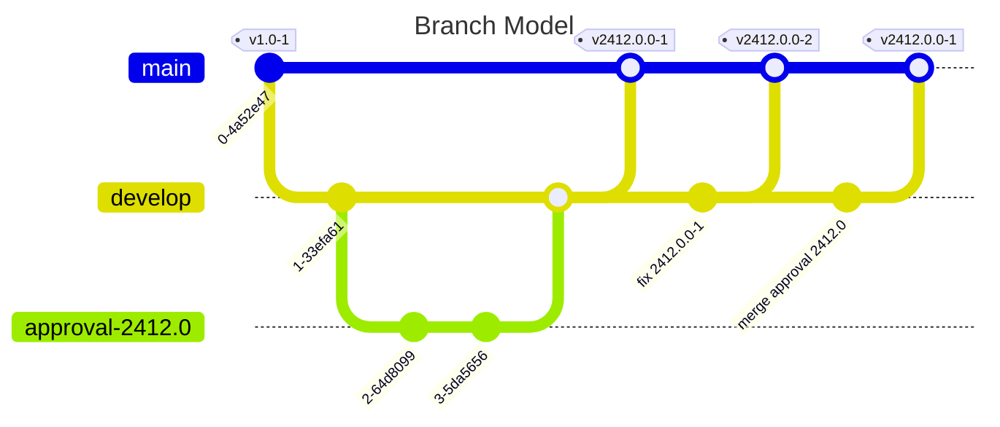

# Introduction

In order to start using the GCC Labs Project you have to add the project to
your Blueprint extensions. The following process assumes, that you will add the
GCC extension as GIT submodule to your workspace. You may as well decide to copy
the sources to your workspace.

To summarize the steps below, everything you need to do:

1. Add GCC to your Blueprint workspace at `modules/extensions`.
2. Configure your extension tool.
3. Run your extension tool to activate the gcc extension.
4. Add `translation-global-link.xml` to your workflow server deployment.
5. Later on: Ensure that your GlobalLink Settings reside in
    `/Settings/Options/Settings/Translation Services/GlobalLink`

## Branches



* **main:** Will be initially used to create `develop` branch. Afterward, it
  will just be used to merge changes from `develop` branch to `main`, i.e., it
  will just be recipient afterward. On _release_ the main merge commit will be
  tagged. See below for details on tagging.

* **develop:** After initial creation, all development by CoreMedia and merging
  pull request will happen here. Also, any pull requests for adjustments should
  have set this as the base branch.

## Tags

The structure of tags is as follows:

```text
v<CMCC Version>-<GlobalLink Workspace Version>
```

Thus, `v2412.0.0-1` signals compatibility with CMCC v12.2412.0.0 and is the
first approved version for usage with GlobalLink workspace. `v2412.0.0-1` is a
patch version for version `v2412.0.0-1`, which is based on the same CMCC
version, but for example contains bug fixes.
