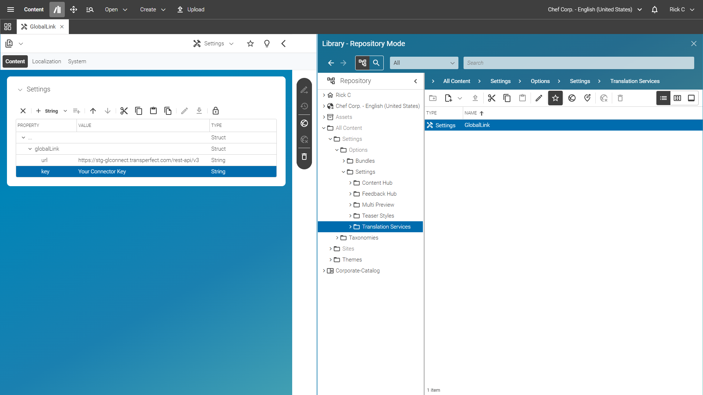

# Configure Connection to GlobalLink Connect Cloud

If the connection is not set up yet, go to `/Settings/Options/Settings/` create
a _Settings_ content called _GlobalLink_ and add it to the _Linked Settings_
property of the master site's homepage.

