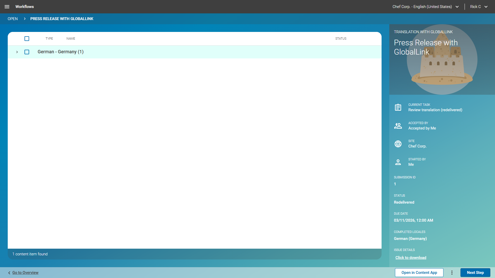

# Further Scenarios

## Manual XLIFF Override &amp; Redelivered Submission State

Translators at GlobalLink may decide to mark a submission as redelivered. It is
expected, that in these cases, the XLIFF is sent via different means to the
editorial team, like, for example, email. The editorial team can then manually
upload the XLIFF to the submission in the Workflow app.

This redelivered state is represented as an extra task "Review Translation
(redelivered)" (with status: "Redelivered"). If, as expected, the original
XLIFF provided by the GCC backend had issues, you can download the (corrupted)
XLIFF along with its issue details just as for the error handling.

